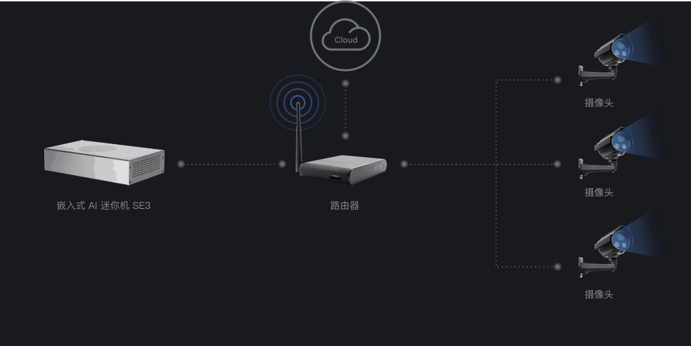

#  V2.2.1

| 文档版本   |            系统版本             |   说明   |
| :-------------: | :-----------------------------: | :------: |
| [V2.2.1](zh/V2R2C01_README.md) | V2R2C01 | 开发版本 |

## 1 优势和特点

## 2 性能参数

## 3 三种应用场景

