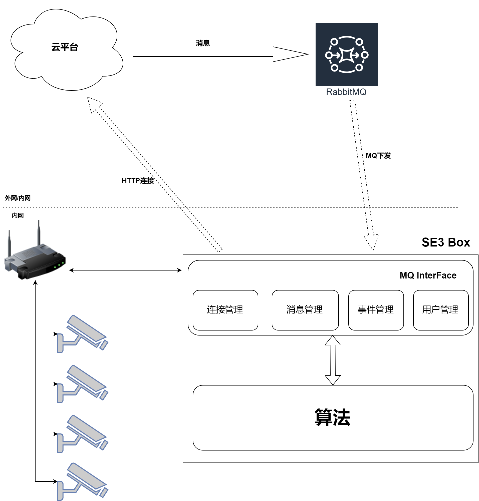

# 1. 1 基于Rabbit MQ的端云系统架构设计

SE3 AI 迷你机提供了一套接口协议，用于规范云平台和SE3 AI 迷你机之间的消息，比对事件，人员信息等行为，详细的系统框架如下：

* 连接管理 用于实现云平台和SE3 AI 迷你机端之间的连接控制，包括MQ参数的获取，MQ channel建立等。
* 消息管理 用于处理接收到的消息。
* 事件管理 用于上传事件管理，包括比对事件（实时上报，历史上报），消息处理结果异常事件（人员注册失败）等。
* 用户管理 用于处理消息中下放的人员ID，并基于人员ID获取到人员的详细信息，并将人员入库等。

