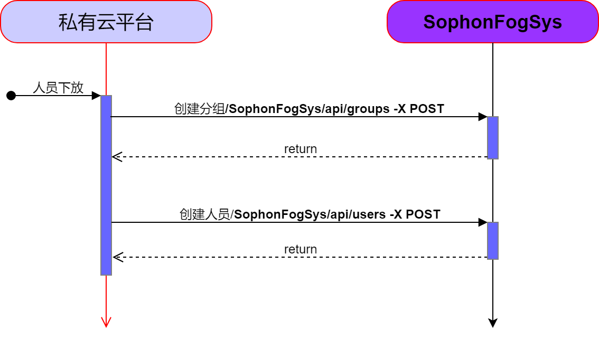
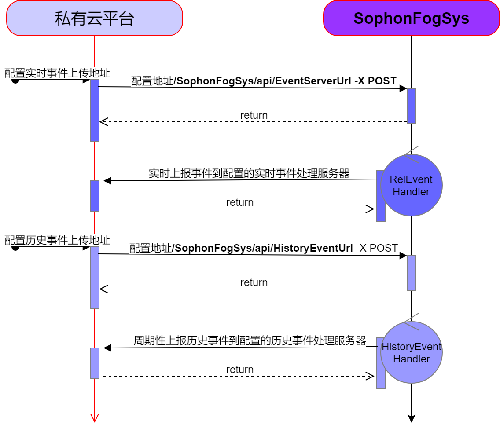
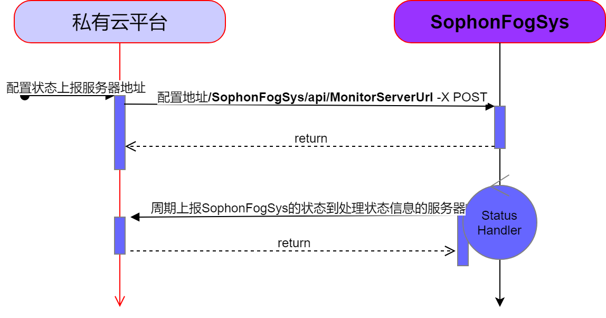

# Sophon人脸识别雾计算系统和云端交互方式

本系统提供了一套遵循restful规范的api，用于实现雾计算系统和云端的信息同步，涵盖了如下一些能力：

- 分组管理
- 人员管理
- 事件管理
- 状态管理

私有云下放人员到Sophon人脸识别雾计算系统的交互过程如下：

私有云和Sophon人脸识别雾计算系统之间事件交互过程如下：

私有云和Sophon人脸识别雾计算系统之间状态交互过程如下：

