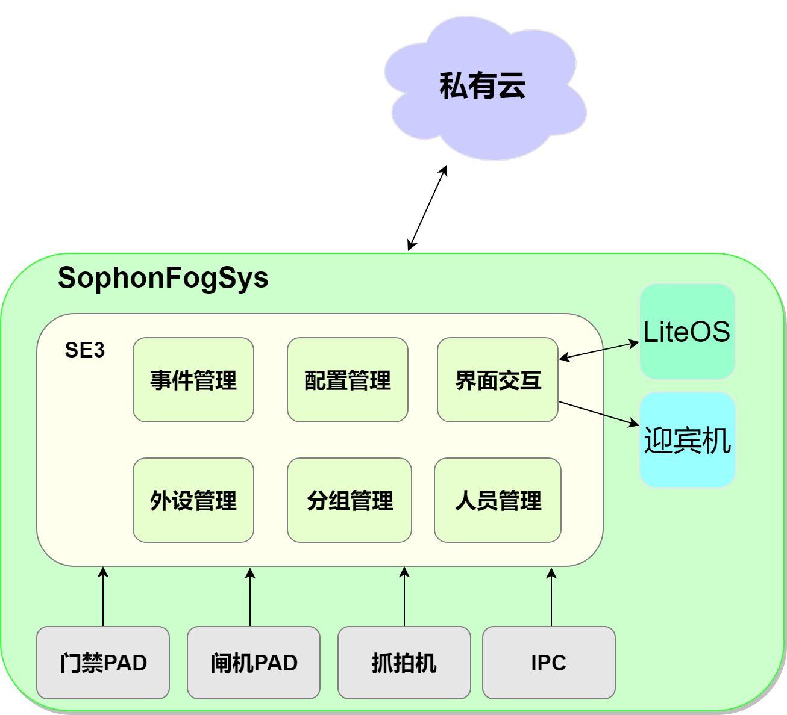
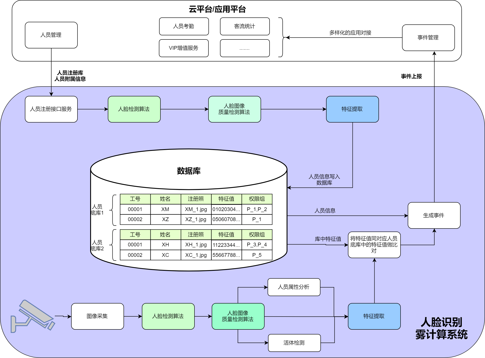

# 2Sophon人脸识别雾计算系统架构

Sophon人脸识别雾计算系统框架如下：

- **SE3**

Sophon AI迷你机 SE3内部集成了一颗BITAMAIN最新发布的张量处理器BM1682。每颗BM1682有64个NPU处理单元，每个NPU有32个EU运算单元。单颗BM1682芯片可以提供高达3TFLOPs的双精度峰值运算力，同时芯片内部有高达16MB的片内SRAM，可以极大减少模型运算时的数据搬运，提升性能，降低功耗。

Sophon AI迷你机 SE3适合应用于人脸闸机、人脸门禁、人脸考勤机以及微场景中的摄像头的后端控制中心。SE3可以接收前端摄像头传来的RTSP视频流或者抓拍到的照片流。

- **LiteOS**

LiteOS是Sophon人脸识别雾计算的本地管理后台。通过LiteOS可以完成一些设备管理，系统配置，状态查询，事件查询，人员和分组管理等工作。

- **门禁/闸机PAD**

Android系统设备，Sophon人脸识别系统提供一个配套的应用APK，提供初步的人脸检测，结果展示，道闸/门禁开关等功能。

- **人脸抓拍机**

抓拍机设备需要指出FTP上传能力，Sophon人脸识别系统在SE3上面搭建了一个FTP服务器，用来接收抓拍机上传的图片，以便做后续的人脸分析。

- **IPC**

RTSP输出。

- **迎宾机**

Android系统设备，Sophon人脸识别系统提供一个配套的应用APK，提供信息展示功能。

Sophon人脸识别雾计算系统注册和识别流程如下：

