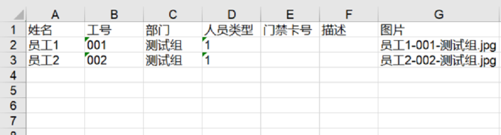

# 批量导入工具

注：最新版本下载地址请联系支持人员

### **1）导入前准备工作**

1、批量导入之前确保尽量不先添加采集端设备进行比对

2、使用批量导入工具之前，先于SE3 AI迷你机上创建对应的权限组部门

3、准备需要导入的图片，图片格式为：**姓名-工号-部门.jpg** 或者 **姓名-工号-部门.png** 。

### 2）双击SE3批量导入工具，开始批量导入流程

1、点击第一步选择图片文件夹

2、对应的数据会自动导入到**SE3批量导入工具根目录**下的名为**批量导入用户信息.xls** 的表格，此时会提示完善表格中的部门等信息。

​		确认和完善部门等信息是否有错误和遗漏，也可以进行编辑，编辑表格**批量导入用户信.xls** 内容如下，编辑完记得关闭excel表格，特别注意：

（1）编辑前需要将所有的单元格格式选择为文本后，再进行编辑，数字类型比如1，就不会变为1.0，单元格里面数字是文本格式左上角有绿色小角提示:

（2）支持用户同时注册多个权限组，用逗号分隔，逗号是半角格式，如：部门1,部门2

（3）员工号重复的情况下，后面的会覆盖前面的信息，比如员工号是100的员工被导入两次，导入信息为后面的员工信息。

3、填写小盒子ip地址，填写前请确保小盒子正常启动，网络连接等正常。

4、点击开始批量注册，会显示注册的时间和当前注册的进度，以及当前成功导入的数量和失败的数量。

5、导入完成后，具体结果可以查看批量导入结果下的 结果统计.xls 。

​		**如果有导入失败的图片，请查看失败原因，修正后可将错误得图片再次重复上述步骤导入。每次导入，批量导入结果中得错误图片等会进行覆盖，所以请保留当前次导入得批量导入结果**。

