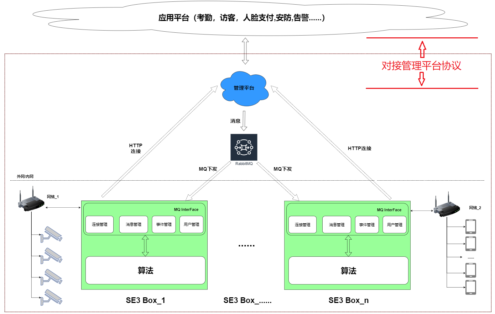

# 对接管理平台

本章节主要介绍用户系统如何和管理平台sophonsight集成，sophonsight提供开放API给用户系统调用达到集成的目的。

  	如下图所示对接管理平台协议部分：
	

- **授权管理**

介绍用户系统如何授权调用sophonsight开放API接口。

| 相关文档                                                     | 说明                                             |
| ------------------------------------------------------------ | ------------------------------------------------ |
| [授权参数生成](./shouquan/1-shou-quan-can-shu.md) | 介绍如何生成appKey、secret等授权参数给用户系统使用产生调用开放API所需接口认证数据。 |
| [授权认证介绍](./shouquan/2-shou-quan-ren-zheng.md) | 介绍接口认证数据的生成。|

- **人员管理**

介绍开放API中人员管理相关的接口，人员管理相关接口可以从用户系统同步人员数据到sophonsight管理平台。

| 相关文档                                                     | 说明                                             |
| ------------------------------------------------------------ | ------------------------------------------------ |
| [组织更新](./renyuan/1-zu-zhi-geng-xin.md) | 介绍从用户系统同步组织数据到sophonsight管理平台相关接口。|
| [人员更新](./renyuan/2-ren-yuan-geng-xin.md) | 介绍从用户系统同步人员数据到sophonsight管理平台相关接口。|

- **通行数据同步**

介绍开放API中人员通行记录相关的接口，通行数据同步接口可以从sophonsight管理平台同步员通行记录数据到用户系统，有两种方式。

1.上报方式：人员通行事件发生时，sophonsight管理平台调用用户系统接口上报人员通行记录。

2.查询方式：用户系统调用sophonsight管理平台接口查询人员通行记录。

| 相关文档                                                     | 说明                                             |
| ------------------------------------------------------------ | ------------------------------------------------ |
| [上报方式](./tongxing/1-shang-bao-fang-shi.md) | 介绍sophonsight管理平台调用用户系统接口上报人员通行记录的接口协议约定。|
| [查询方式](./tongxing/2-cha-xun-fang-shi.md) | 介绍sophonsight管理平台人员通行记录查询相关的接口。|
| [设备查询](./tongxing/3-she-bei-cha-xun.md) | 介绍人员通行相关设备信息的查询接口。|

- **设备监控**

介绍开放API中设备监控相关的接口，目前主要是sophonsight管理平台调用用户系统接口上报设备状态给用户系统。

| 相关文档                                                     | 说明                                             |
| ------------------------------------------------------------ | ------------------------------------------------ |
| [设备状态上报](./shebei/1-she-bei-shang-bao.md) | 介绍sophonsight管理平台调用用户系统接口上报设备状态的接口协议约定。|

- **访客管理**

介绍开放API中访客管理相关的接口，目前主要是访客登记接口。

| 相关文档                                                     | 说明                                             |
| ------------------------------------------------------------ | ------------------------------------------------ |
| [访客登记](./fangke/1-fang-ke-deng-ji.md) | 介绍sophonsight管理平台访客登记接口。|
