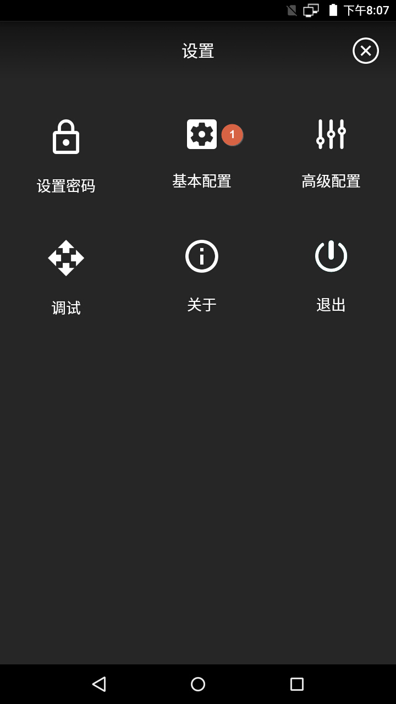
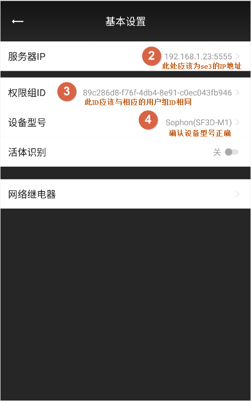

# 闸机模式

# 一、系统网络图

1. 参考下图，将各个设备加入同一局域网络内。

   

# 二、闸机和门禁机设置

1. 查看闸机或门禁机的IP地址，后面配置中会用到。
   在阃或门禁机设备屏幕上单击，右上角会出现“设置”图标，进入到设置页面。然后在“关于”页面查看IP地址，记在本子上。
   

   

# 三、SE3 AI迷你机设置

1. 使用Chrome浏览器，打开SE3 web界面: https://se3-ip:8886/，然后输入用户名和密码（默认均为admin）。
   

2. 设置工作模式为“单机模式”
   

3. 设置设备类型为“闸机模式”
   

4. 添加对应权限组

   

   增加完成后如下图所示。可以点 “Add”继续增加其它权限组。

   

   

5. 为权限组增加相应的用户
   
   
   增加完毕后，用户列表显示如下：
   

6. 添加闸机
   

   务必选择正确的闸机门禁的型号，否则闸机门禁设备的无法正常显示。

   通常网络环境下，所有连接到局域网中的闸机门禁设备会自动出现在列表中，按需要勾选并添加即可。但如果闸机门禁设备与SE3不在同一个网段内，则不会自动出现在设备列表中，这时你需要选择手工添加按钮进行手工添加。
   

   

   选择 Details 编辑设备信息
   

7. 确认闸机或门禁机接收到配置
   在阃或门禁机设备屏幕上单击，右上角会出现“设置”图标，进入到设置页面。选择“基本配置”，确认2，3，4项的内容是否正确。

   

# 四、系统功能验证

1. 进行人脸识别验证
   请已经注册的人员站在闸机或门禁机前面适合位置上（设备正前方约1米左右），确认系统可以识别出正确的用户并且将注册照片回显在屏幕上。
   
2. 查看识别历史记录
   正常情况下，这时可以在识别历史记录页查查看到刚才识别成功的事件。
   