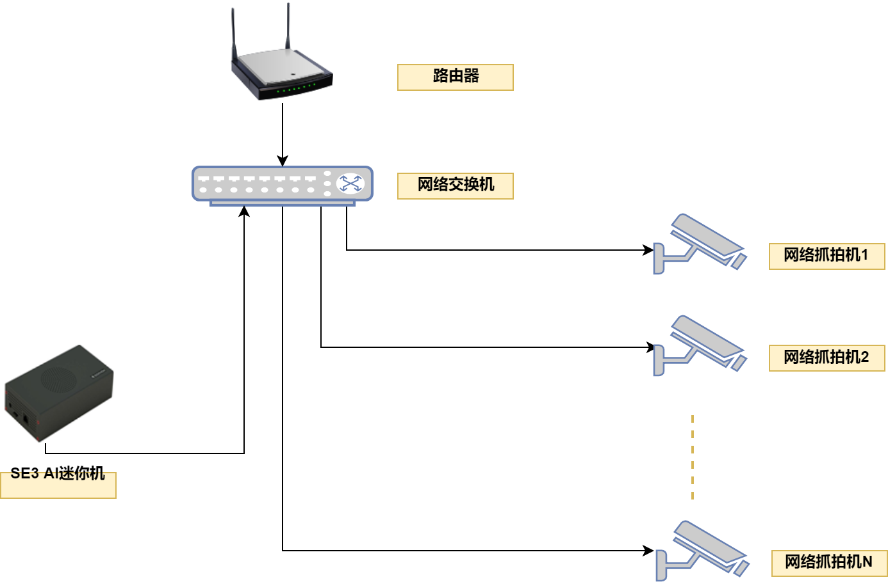
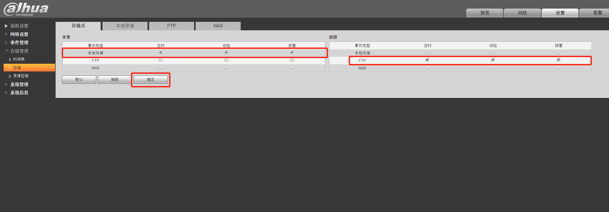
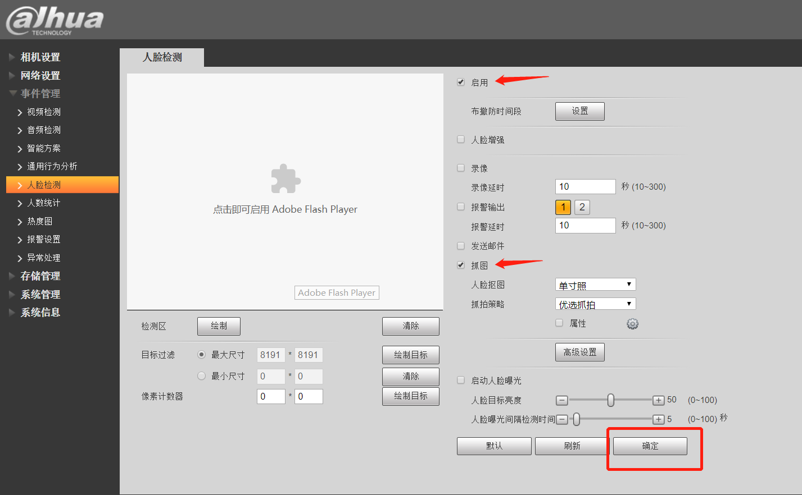
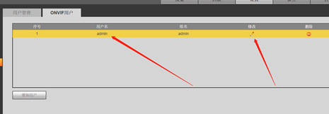
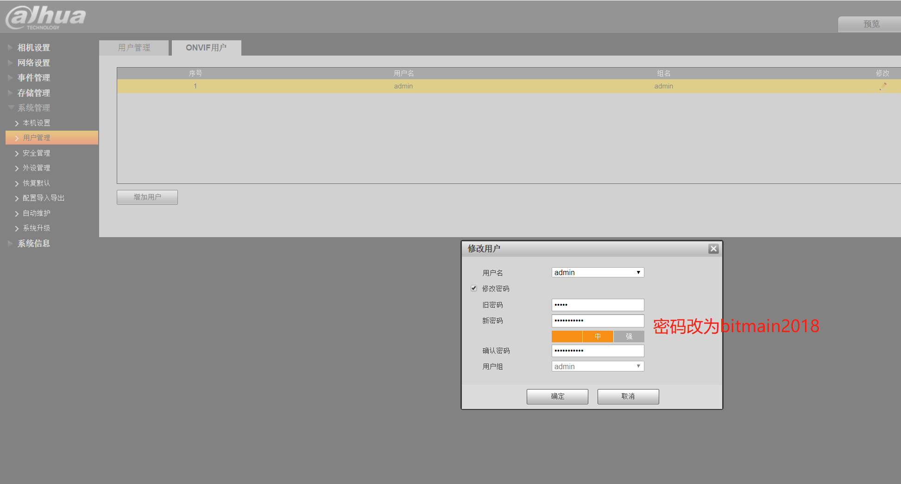
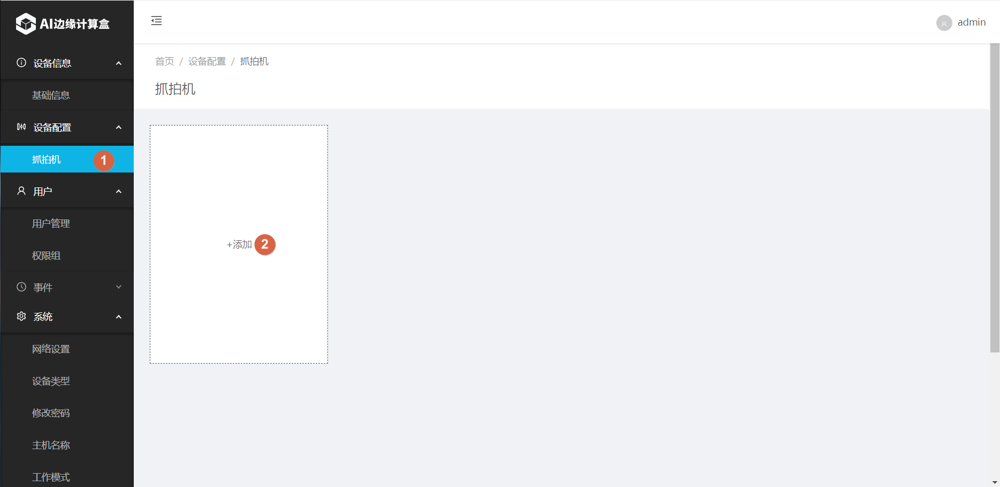

# 抓拍机模式

# 一、系统网络图

1. 参考下图，将各个设备加入同一局域网络内。
   

# 二、设置抓拍机设备

1. 使用Chrome浏览器，登陆到抓拍机Web页面。
   不同的抓拍机登陆界面不尽相同，本文中以大华抓拍机(IPC-HFW4243K-ZFD-LED)举例说明。
   

2. 进入存储管理，打开存储，配置左右两个ftp如图所示。
   

3. 设置FTP存储地址到SE3
   

4. 确认打开智能方案中的人脸检测。
   

5. 确认启用人脸检测和人脸抓图。
   

6. 选择要修改的用户名。
   

7. 点击修改密码, 设置pyonvif得用户名和密码为：admin 和 bitmain2018。
   

8. 重启抓拍机。

   

# 三、SE3 AI迷你机设置

1. 使用Chrome浏览器，打开SE3 web界面: https://se3-ip:8886/，然后输入用户名和密码（默认均为admin）。
   

2. 设置工作模式为“本地模式”
   

3. 设置摄像机类型为“抓拍模式”
   

4. 添加对应用用户组

   

   增加完成后如下图所示。可以点 “Add”继续增加其它用户组。

   

   

5. 为用户组增加相应的用户
   
   
   增加完毕后，用户列表显示如下：
   

6. 添加抓拍机

   

   通常网络环境下，所有连接到局域网中的抓拍机设备会自动出现在列表中，请按需要勾选并添加。但如抓拍机没有自动出现在设备列表中，这时你也可以选择手工添加的方式添加设备。
   

   选择 Details 编辑设备信息
   

   

# 四、系统功能验证

1. 人脸识别验证
   请系统中已经注册的人员站在抓拍机的合适位置（抓拍机焦距不同，对应的可识别位置范围也不同，以实际为主）。再到事件历史记录页面查看历史记录，正常情况下，可以看到识别成功的事件。
   