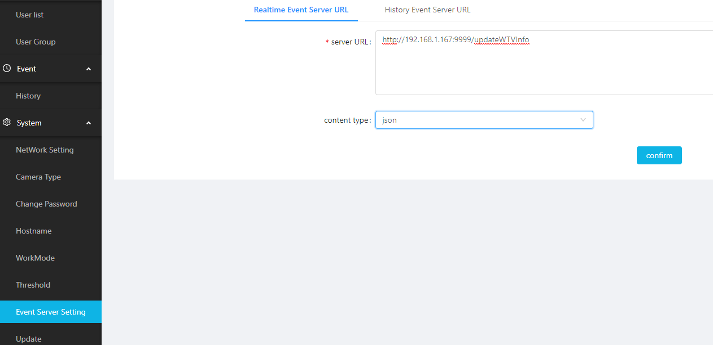

# 抓拍机设置

1. 参照[人脸识别系统抓拍机模式快速配置指南]()，完成抓拍机设置系统设置。
2. 设置迎宾电视的接收路径：
   在System下Event Server Setting中Realtime Event Server URL中添加电视的接收路径：[http://ip-of-tv:9999/updateWTVInfo](http://192.168.1.130:9999/updateWTVInfo")
   如果系统中有多台迎宾电视，这里也可以设置多个接收源，以英文半角逗号区隔开。

