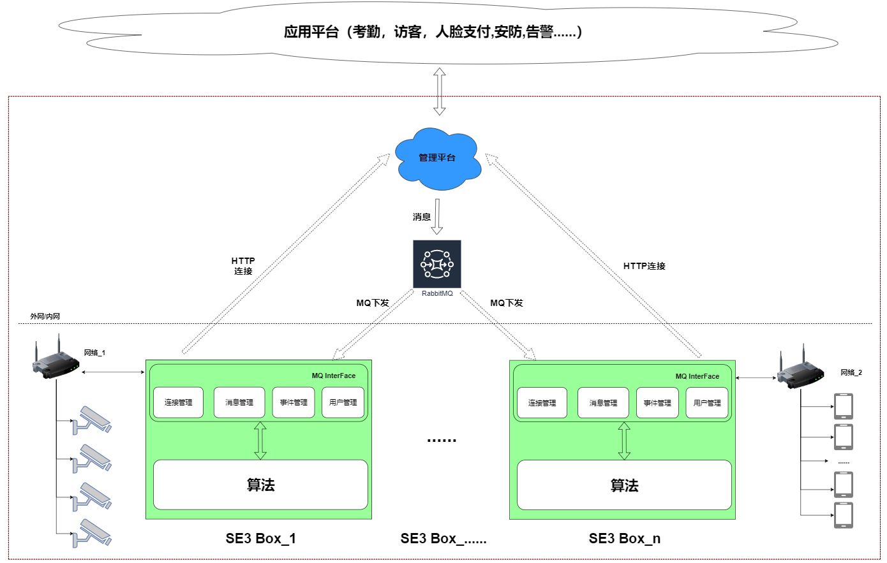

# 灵活方便的系统对接

整个系统框架如下：

图中，被红色虚线框定的是已经完成的样本系统，提供SE3 AI迷你机管理，采集设备管理等。

客户在系统对接的过程中，可以[对接现有的管理平台](dui-jie-guan-li-ping-tai/README.md) 或是[自建管理平台](../xi-tong-dui-jie-shuo-ming-shu/dui-jie-SE3-he-zi\README.md)

+ 对接现有的管理平台
  + 只需要对接人员信息即可
  + 支持一个或多个SE3 AI迷你机场景
  + 简单，便捷，开发周期短

+ 自建管理平台
  + 需要遵循《[SE3迷你机管理协议](../xi-tong-dui-jie-shuo-ming-shu/dui-jie-SE3-he-zi\README.md)》
  + 支持一个或多个SE3 AI迷你机场景
  + 灵活，可自定义产品