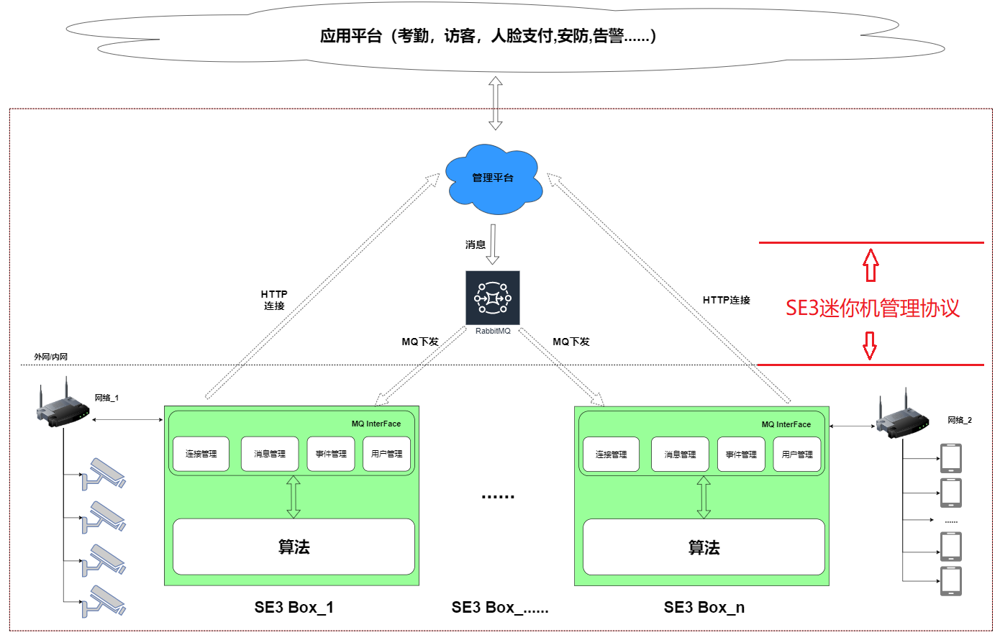

# SE3迷你机管理协议说明

​		本协议主要规范负责管理平台和SE3 AI迷你机之间的数据交互，包括连接管理，用户管理，事件管理和设备状态上报等。

  	其作用域如下图所示：

- **连接管理**

用于实现用于平台和SE3 AI 迷你机端之间的连接控制，包括MQ参数的获取，MQ channel建立等。

| 相关文档                                                     | 说明                                             |
| ------------------------------------------------------------ | ------------------------------------------------ |
| [建立连接流程](../../1.-ji-yu-rabbit-mq-de-duan-yun-dui-jie-shuo-ming/2.-mq-jie-kou-liu-cheng-shuo-ming/2.1-jian-li-lian-jie.md) | 介绍SE3 AI迷你机如何登录到管理平台               |
| [接口登录](../../1.-ji-yu-rabbit-mq-de-duan-yun-dui-jie-shuo-ming/4.-guan-li-ping-tai-xi-tong-deng-lu-jie-kou.md) | 规定SE3 AI迷你机登录请求参数，及管理平台返回参数 |

- **用户管理**

用于处理消息中下放的人员ID，并基于人员ID获取到人员的详细信息，并将人员入库等。

| 相关文档                                                     | 说明                                                         |
| :----------------------------------------------------------- | ------------------------------------------------------------ |
| [用户管理流程](../../1.-ji-yu-rabbit-mq-de-duan-yun-dui-jie-shuo-ming/2.-mq-jie-kou-liu-cheng-shuo-ming/2.2-yong-hu-guan-li.md) | 介绍SE3 AI迷你机和管理平台之间用户信息同步流程               |
| [添加或更新用户](../../1.-ji-yu-rabbit-mq-de-duan-yun-dui-jie-shuo-ming/5.-mq-ming-ling-jie-kou-xiang-xi-shuo-ming/5.1-yong-hu-guan-li-mq-xiao-xi/5.1.1-tian-jia-huo-geng-xin-yong-hu-addusersplus.md) | 管理平台向 SE3 AI 迷你机下发用户列表和用户详细信息。 本协议支持如下两种的数据同步方式：         消息中携带用户信息         [独立接口获取用户详细信息](../../1.-ji-yu-rabbit-mq-de-duan-yun-dui-jie-shuo-ming/6.-xiang-guan-li-ping-tai-huo-qu-xin-xi-de-jie-kou-ding-yi/6.1-huo-qu-yong-hu-xiang-xi-xin-xi-de-jie-kou.md) |
| [删除用户](../../1.-ji-yu-rabbit-mq-de-duan-yun-dui-jie-shuo-ming/5.-mq-ming-ling-jie-kou-xiang-xi-shuo-ming/5.1-yong-hu-guan-li-mq-xiao-xi/5.1.2-shan-chu-yong-hu-deleteusers.md) | 管理平台告知SE3 AI迷你机删除一个或多个用户信息               |
| [人脸图像检测](../../1.-ji-yu-rabbit-mq-de-duan-yun-dui-jie-shuo-ming/5.-mq-ming-ling-jie-kou-xiang-xi-shuo-ming/5.3-ren-lian-tu-pian-zhi-liang-jian-ce-fiqamq-xiao-xi.md) | 管理平台请求SE3 AI迷你机对人脸图像做质量检测                 |

- **事件管理**

| 相关文档     | 说明  |
| --------------- | ---------------------- |
| [事件上报](../../1.-ji-yu-rabbit-mq-de-duan-yun-dui-jie-shuo-ming/7.-she-bei-shang-bao-xin-xi-de-jie-kou-gui-fan/README.md) | 规定了SE3 AI迷你机向管理平台上报事件的过程及数据格式。 内容包括：实时事件和历史事件，格式，时机等。 |

- **设备管理**

| 相关文档   | 说明   |
| ---- | ------ |
| [采集设备配置上报](../../1.-ji-yu-rabbit-mq-de-duan-yun-dui-jie-shuo-ming/7.-she-bei-shang-bao-xin-xi-de-jie-kou-gui-fan/7.1-shi-shi-shi-jian-shang-bao-nei-rong.md) | 规定了SE3 AI迷你机向管理平台上报设备状态的过程及数据格式。 内容包括：SE3 AI迷你机，连接的采集设备的状态。  |
| 采集设备状态上报 | 规定了SE3 AI迷你机想管理平台上报“配置采集设备”动作的过程及数据格式。 内容包括：操作（增加/删除），采集设备类型，ID等。 |

- **系统管理**

| 相关文档 | 说明    |
| ------ | ------ |
| [设备数据清理](../../1.-ji-yu-rabbit-mq-de-duan-yun-dui-jie-shuo-ming/5.-mq-ming-ling-jie-kou-xiang-xi-shuo-ming/5.2-she-bei-shu-ju-qing-li-mq-xiao-xi.md) | 规定了清空SE3 AI迷你机上数据的协议，包括清空用户，清空事件等消息 |

- **消息处理结果反馈**

| 相关文档 | 说明   |
| -------------------- | ------------------ |
| [消息处理结果](../../1.-ji-yu-rabbit-mq-de-duan-yun-dui-jie-shuo-ming/5.-mq-ming-ling-jie-kou-xiang-xi-shuo-ming/5.4-mq-zhi-hang-jie-guo-fan-hui-jie-kou.md) | SE3 AI迷你机向管理平台反馈消息处理结果。 |
| [状态码详细说明](../../1.-ji-yu-rabbit-mq-de-duan-yun-dui-jie-shuo-ming/3.-zhuang-tai-ma-xiang-xi-shuo-ming.md) | 状态码定义    |

协议的版本更新，请参考文档[历史版本](../../1.-ji-yu-rabbit-mq-de-duan-yun-dui-jie-shuo-ming/README.md)信息。