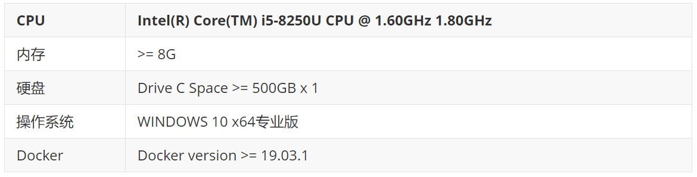
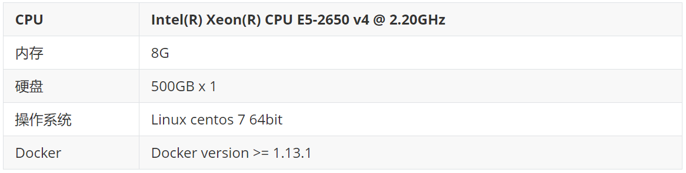
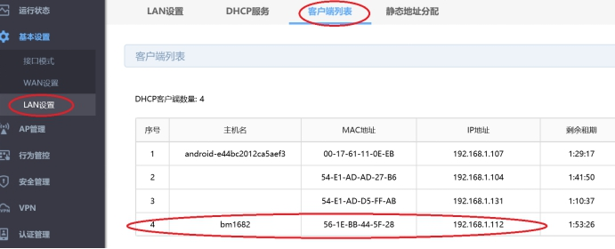
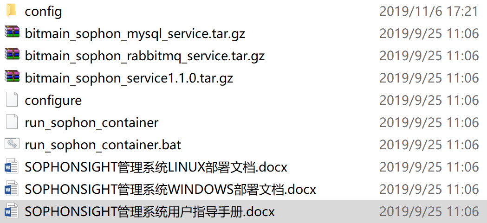

# 设备配置指南

## 环境准备：

- Chrome浏览器

- IE浏览器（摄像头及抓拍机配置使用）

- TF Card及读卡器（如果需要升级AI迷你机软件版本）

- PC（如有管理平台需求，可使用现有机器）

  - **Windows平台**

    

  - **Linux平台**

    

- 网络分配：

  所有接入到局域网的设备都需要**固定IP分配且有线连接**，至少包括如下几个固定IP：

  - AI迷你机 1个
  - 管理平台PC（视系统需求） 1个
  - 迎宾机（视系统需求）1个
  - 摄像头采集终端（门禁PAD，闸机PAD，摄像头）若干

## 单机模式下系统配置

#### 	Step1：升级AI迷你机到指定版本

​	当前版本查看方式，请参考[《AI迷你机使用说明书》](../../../../../AIBOX/zh/V2R3C01/api-lie-biao/SE3-AI-Mini-ji-shuo-ming-shu/README.md)中"3.3 进入主页面"小节。

​	若无需升级，请忽略此步骤。

​	如果需要升级，请参考《[AI迷你机系统升级说明](../../../../../AIBOX/zh/V2R3C01/api-lie-biao/3.ke-hu-zhi-chi/3.update_support/README.md)》。

​	通过路由器查看BM1682 SE3 IP地址，如下图所示，通过登陆TP-LINK R479G+可以查看到AI迷你机的IP地址为`192.168.1.112`

 

​     如果还是没有办法找到SE3 AI 迷你机ip，通过https://www.advanced-ip-scanner.com/cn/来扫描，在扫描的结果中，可以通过制造商“Bitmain Technologies Inc”来确认小盒子IP地址。

#### 	Step2：人员添加

#### 	Step3：添加摄像头采集终端到AI迷你机

​	请将AI迷你机工作模式切换到“单机模式”，并根据接入的采集端设备类型选择对应的模式完成设备添加。

- [网络摄像机模式](wang-luo-she-xiang-ji-mo-shi/README.md)

- [闸机模式](zha-ji-mo-shi/README.md)

- [抓拍机模式](zhua-pai-ji-mo-shi/README.md)

  注：如何切换“单机模式”，设置方法请参考[《AI迷你机使用说明书》](../../../../../AIBOX/zh/V2R3C01/api-lie-biao/SE3-AI-Mini-ji-shuo-ming-shu/README.md)中“3.7 系统”章节”“(5) 点击工作模式修改工作模式”。

#### Step4：比对验证

​	可以通过查看事件记录来判断整个系统是否搭建完成。事件查看方法，请参考[《AI迷你机使用说明书》](../../../../../AIBOX/zh/V2R3C01/api-lie-biao/SE3-AI-Mini-ji-shuo-ming-shu/README.md)中“3.6 事件”章节。

## 管理平台模式下系统配置

#### Step1: 下载软件

​	管理平台软件下载，请咨询支持人员。

​	在下载的包中，解压之后，会在目录下有如下的文件：

#### Step2：安装管理平台

​	如何安装管理平台，请基于PC的系统版本，选择对应的部署文档进行。

#### Step3：生成盒子的授权码

​	请参考《SOPHONSIGHT管理系统用户指导手册》中的“2.4 AI智能盒子授权管理”，为AI迷你机生成一个授权码。

#### Step4：升级AI迷你机到指定版本

​	当前版本查看方式，请参考[《AI迷你机使用说明书》](../../../../../AIBOX/zh/V2R3C01/api-lie-biao/SE3-AI-Mini-ji-shuo-ming-shu/README.md)中"3.3 进入主页面"小节。

​	若无需升级，请忽略此步骤。

​	如果需要升级，请参考《[AI迷你机系统升级说明](../../../../../AIBOX/zh/V2R3C01/api-lie-biao/3.ke-hu-zhi-chi/3.update_support/README.md)》。

通过路由器查看BM1682 SE3 IP地址，如下图所示，通过登陆TP-LINK R479G+可以查看到AI迷你机的IP地址为`192.168.1.112`

 

​     如果还是没有办法找到SE3 AI 迷你机ip，通过https://www.advanced-ip-scanner.com/cn/来扫描，在扫描的结果中，可以通过制造商“Bitmain Technologies Inc”来确认小盒子IP地址。

#### Step5：配置管理平台信息

​	首先，请将AI迷你机的工作模式设置为管理平台模式。设置方法请参考请参考[《AI迷你机使用说明书》](../../../../../AIBOX/zh/V2R3C01/api-lie-biao/SE3-AI-Mini-ji-shuo-ming-shu/README.md)中“3.7 系统”章节”“(5) 点击工作模式修改工作模式”。

​    关于管理平台登录地址：如果管理平台安装的PC地址为192.168.1.102，那么管理平台登录地址应该为：http://192.168.1.102:9061/api/gateway/login

#### Step6：添加摄像头采集终端到AI迷你机

​	请根据接入的采集端设备类型选择对应的模式完成设备添加。

- [网络摄像机模式](wang-luo-she-xiang-ji-mo-shi/README.md)
- [闸机模式](zha-ji-mo-shi/README.md)
- [抓拍机模式](zhua-pai-ji-mo-shi/README.md)

#### Step7：手动下放数据

​	请参考《SOPHONSIGHT管理系统用户指导手册》中的“2.2 人员组织”，“2.3 权限组管理”完成人员和权限组设置。

​	再参考《SOPHONSIGHT管理系统用户指导手册》中的“2.4 智能盒子授权管理“，选择一个授权码，点击“编辑”，将权限组绑定给授权码。

​	然后点击”下放数据“

#### Step8：比对验证

​	请参考《SOPHONSIGHT管理系统用户指导手册》中的“2.7 数据统计”，查看产生的事件。