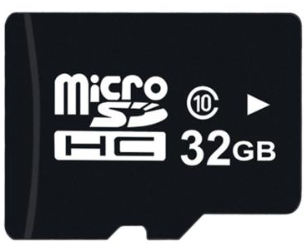
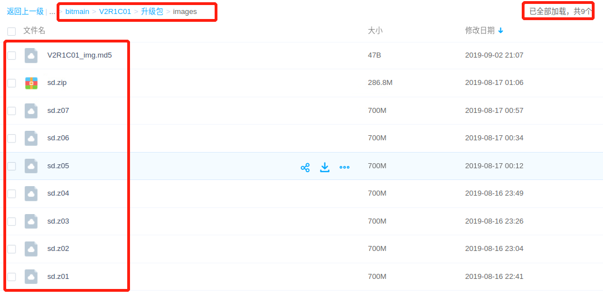
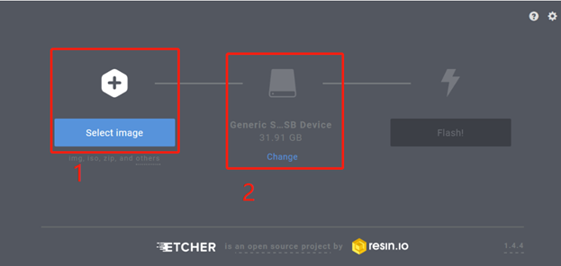

# AI迷你机系统升级说明

本文介绍版本升级是通过SD卡烧录方式进行。

请提前准备：

​	1）至少16G 存储的Micro SD。

​	2）一个配套的读卡器

## 获取最新版本

注：最新版本下载地址请联系支持人员。

### 1）下载版本：

因为上传工具限制及方便下载，一般将版本对应的文件拆分成几个文件。比如：V2R1C01版本在网络上的存储结构如下：

每个版本需要将"版本/升级包/images"下面的所有文件全部下载，并保存到同一个目录下面。

### 2）解压文件并校验

所有的文件都下载完成后，选择sd.zip --> 右键 --> 解压文件，选择存放的路径，点击“确定”后，在对应的目录下面会生成一个sd.img，请判断该sd.img同*.md5中数据是否一致，若一致则表明版本下载完成。

## 制作SD卡

### 1）下载Etcher

软件etcher下载地址为：https://www.balena.io/etcher/

支持windows，linux，macOS，请参照系统下载。

### 2）使用Etcher制作升级卡

(1) 选择版本对应的sd.img

(2) 选择需要烧写的Micro SD卡

(3) 点击Flash，并等待烧录完成。

## 升级SE3 AI迷你机版本

整个升级过程持续15~20分钟，期间需要手动**重启一次**。

1）拔掉电源，插上SD card，再插上电源；

2）小盒子风扇高速转动，3~8s后，转低速转动，红灯亮起。

3）等待10~15分钟，红灯灭掉。拔掉电源，拔掉SDcard。

4）重新插上电源，小盒子风扇高速转动，3~8s后，转低速转动。

5）等待15~20s后，绿灯闪烁，升级结束。

## 确认系统版本

升级完成后，SE3 AI迷你机默认IP地址为：**192.168.180**

WebUI访问地址为：https://192.168.1.180:8886

用户名：admin

密码：admin

登录成功后，请及时修改密码。

​	注意：暂时只支持Chrome  76.0.3809.132（其他版本兼容性未确认）

