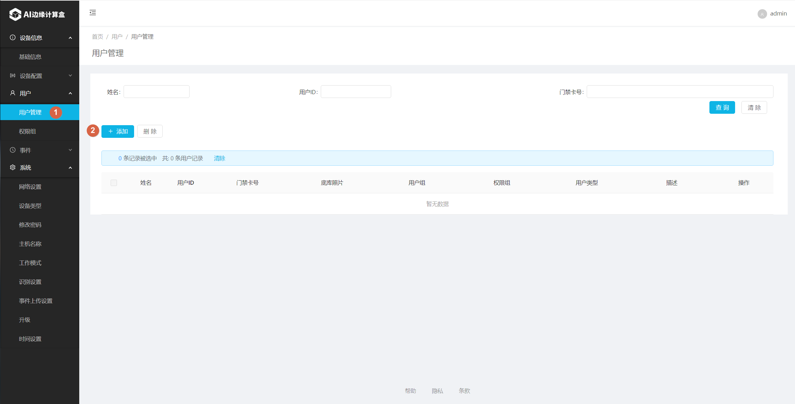

# SE5 AI迷你机设置

###### 登录SE5

使用Chrome浏览器，打开SE5 web界面: https://se5-ip:8886/，然后输入用户名和密码（默认均为admin）。

###### 设置工作模式为“单机模式”

###### 添加对应权限组

增加完成后如下图所示。可以点 “Add”继续增加其它权限组。

###### 为权限组增加相应的用户

增加完毕后，用户列表显示如下：

###### 设备管理

2. 点击“添加”按钮弹出添加设备弹窗
3. 输入“闸机名称”
4. 选择"photo"类型，并输入正确的"闸机ip地址"
5. 选择正确的"权限组"
6. 点击“确认”按钮，添加闸机设备成功
7. 点击“编辑”修改闸机设备信息

###### 确认闸机或门禁机接收到配置

在阃或门禁机设备屏幕上单击，右上角会出现“设置”图标，进入到设置页面。选择“基本配置”，确认2，3项的内容是否正确。

