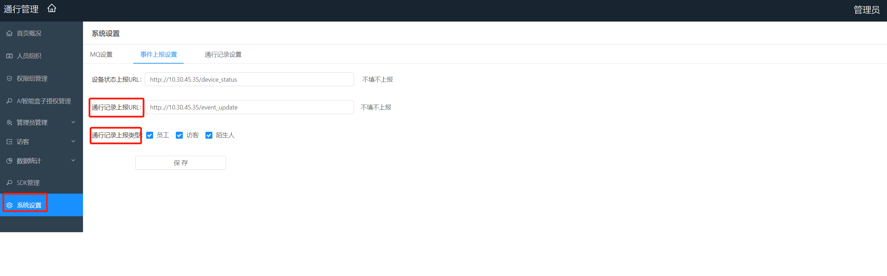

# 上报方式 #

人员通行事件发生时，sophonsight管理平台调用用户系统接口上报人员通行记录给用户系统。本章节介绍相关上报接口的约定协议，用户系统按约定协议实现接口，管理员登录sophonsight管理平台配置上对应URL。

## 1.1 相关配置 ##

在sophonsight管理平台通行管理->系统设置页面，点击事件上报设置可以进行相关的配置。包括通行记录上报URL和通行记录上报人员类型。如下图：

## 1.2 接口列表 ##

上报接口由第三方实现，在事件发生时调用第三方接口，给对方上报对应事件

### 1.2.1 人员通行记录上报 ###

AI盒子向管理系统上报通行记录时，管理平台上报通行记录给第三方系统。

**URI**

第三方给出，在管理系统配置上

**Method**

POST

**请求参数**

参数|类型|是否必填|说明
--  | -- | ------ |
userId|String|是|人员Id
userName|String|是|人员名称
userType|String|是|人员类型；MEMBER：员工、VIP：vip、VISITOR：访客、BLACKLIST：黑名单人员，STRANGER：陌生人
matchScore|String|是|盒人脸匹配分值,取值0-1
photoId|String|是|抓怕人脸照片
crossTime|String|是|事件上报时间
deviceId|String|是|盒子Id
cameraId|String|是|采集端设备Id
cameraIp|String|否|采集端设备Ip
cameraType|String|否|采集端设备类型 0：闸机，1：抓拍机 2：IPC 静态 3：IPC 动态 4：门禁
userPhoto|String|否|底库照片Base64串,sophonsight管理后台配置控制是否上报该信息
userPhotoId|String|否|底库照片Id,sophonsight管理后台配置控制是否上报该信息，和userPhoto一个配置项
crossSrcPhoto|String|否|抓拍原始照片Base64串,sophonsight管理后台配置控制是否上报该信息
crossFacePhoto|String|否|抓拍人脸照片Base64串,sophonsight管理后台配置控制是否上报该信息
crossFaceId|String|否|抓拍人脸照片Id

**请求示例**

    curl -d 
    '
    {
        "cameraId": "epid001",
        "crossTime": 1562083200000,
        "deviceId": "sn_hlq",
        "matchScore": 0.5699999928474426,
        "photoId": "946f61b94a7b48519b706e126ed28623.jpg",
        "userId": "200005",
        "userName": "hlq14",
        "userType": "VIP",
        "cameraType":0,
        "cameraIp":"192.168.1.107",
        "userPhotoId":"xxx.jpg",
        "userPhoto":"xxx",
        "crossFaceId":"xxx.jpg",
        "crossSrcPhoto":"xxx",
        "crossFacePhoto":"xxx"
    }
    '
    -H 'Content-Type: application/json;charset=UTF-8'
    'http://第三方uri'

**返回参数**

无

**返回示例**

    {     
    	"message": "SUCCESS",
    	"status": 0
    }
