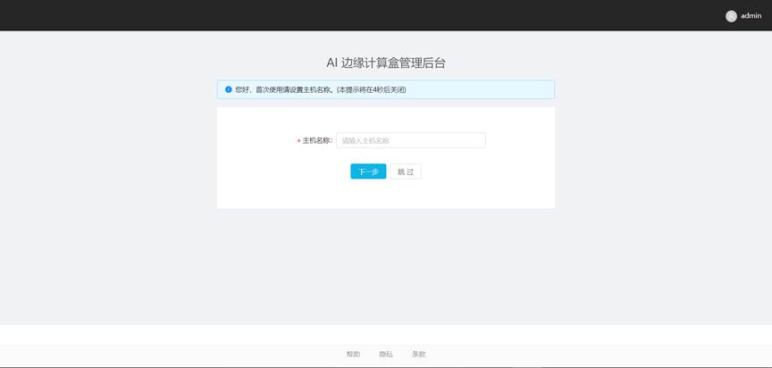
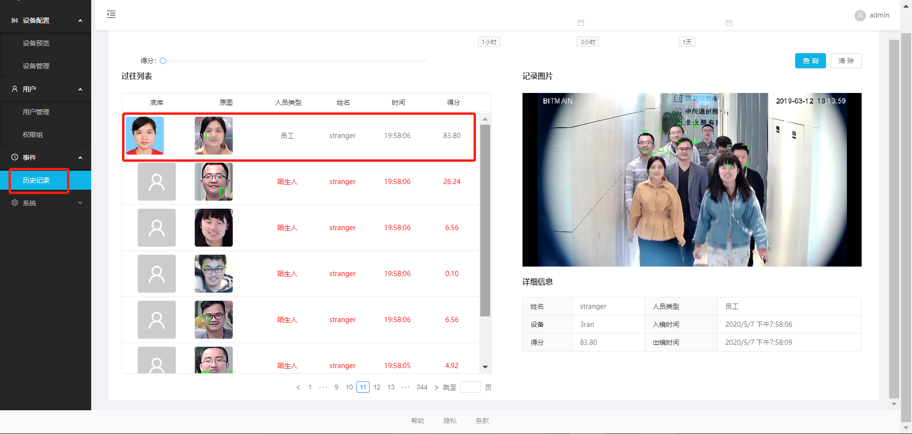

# SE5快速配置指南

## 1 环境准备：

- Chrome浏览器

- 网络分配：

  所有接入到局域网的设备都需要固定IP分配且有线连接，至少包括如下几个固定IP：

  - AI计算盒SE5 1个
  - 摄像头采集终端 1个或多个
  - 一台装有chrome浏览器的PC（windows / Linux ） 1个
  - 一台可以支持HDMI接口输入的显示器

## 2 硬件连接：

### 2.1 网络连接

SE5提供两个RJ45的网口：

LAN：默认为静态固定IP分配，不可更改，IP地址为：192.168.150.1

WAN：默认为动态地址分配

在硬件连接的时候，建议AI计算盒SE5接入的网络的接口为**WAN口**。


### 2.2 HDMI连接 

使用HDMI连接线连接AI计算盒SE5和显示器。

## 3 快速获取AI计算盒SE5 IP地址

方式一：使用显示器查看WAN口分配到的地址

方式二：使用IP Scanner获取WAN口分配到的地址

```
     如果还是没有办法找到AI计算盒ip，通过https://www.advanced-ip-scanner.com/cn/来扫描，在扫描的结果中，可以通过制造商“Bitmain Technologies Inc”来确认小盒子IP地址。
```

方式三：PC直接通过LAN口和AI计算盒建立连接

## 4 快速配置说明

#### 	Step1：登陆AI计算盒管理后台

​		假设AI计算盒网络信息如下：

- WAN口IP地址为：192.168.1.180

- LAN口IP地址为：192.168.150.1

  则可以选择以下任一种方式，登陆到AI计算盒管理后台。

  http://192.168.1.180

  http://192.168.150.1

  请先确认，PC可以通过该IP ping通AI计算盒。

#### 	Step2：配置开机向导


​	默认的用户名密码为admin/admin。

1）配置主机名称

根据初始化提示设置AI计算盒SE5主机名称，输入名称，点击“下一步”。



2）配置WAN口IP地址

3）配置LAN IP地址

默认LAN口的IP地址不允许更改。


4）配置工作模式。

目前支持两种工作模式。

•             单机模式。

•             管理平台模式。管理平台模式需要配合[管理平台](../../api-lie-biao/xi-tong-dui-jie-shuo-ming-shu/dui-jie-guan-li-ping-tai/README.md)使用。

请选择**本地模式**。

 

 5）配置完成之后，请依照提示，重启小盒子。

#### 	Step3：快速添加人员

​	1）创建一个test权限组：


弹出的对话框中，输入一个“test”名称的权限组。


2）添加人员


在弹出的对话中，依次输入必要的信息：


依次：上传照片，姓名，用户ID，人员类型（员工），权限组（test），点击确定。


#### Step4：添加设备

​	请将摄像头连接进入内网。假设摄像头的rtsp码流地址为：rtsp://192.168.1.88:554/av0_0。在添加之前，可以使用VLC软件来确认当前码流地址是否正常。


依次输入

 	名称：test_ipc

​	地址：选择RTSP类型，输入框中输入rtsp://192.168.1.88:554/av0_0

​	权限组：下拉选择”test“
点击确认。


#### Step5 查看预览


#### Step6 查看事件



