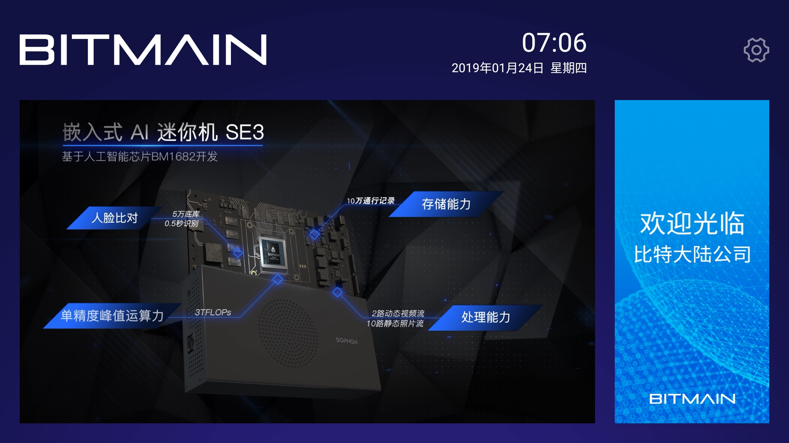

# 迎宾电视APK操作指南

#### 迎宾电视APK快速接入

##### 1. 配置websocket


首先确保“设备管理”有绑定设备（闸机/抓拍机），如上图，绑定名称为“70”的设备。


1. 在设置界面，点击“websocket设置”进入websocket设置界面；

2. 配置websocket服务器Ip地址[小盒子IP地址]；

3. 点击“要绑定的设备”，进入“选择要绑定的设备”界面；

4. 选择需要绑定的设备；

5. 点击“完成”，完成websocket绑定设备操作；

6. 点击“完成”完成websocket整个流程的配置。

##### 2. 选择要显示的人员类型


1. 点击要显示的人员类型设置，进入“选择要显示的人员类型”页面；
2. 点击要在迎宾首页展示的人员类型；
3. 点击确认，配置完成。




#### 迎宾电视APK操作指南

##### 4.1 在哪里下载迎宾机APK？

内部下载地址是：

[http://11.72.220.12:8080/apks/autobuild/WelcomeTV/origin/master/](http://11.72.220.12:8080/apks/autobuild/WelcomeTV/origin/master/34651a6/WelcomeTV-202004260755-V5.2.1-16-g34651a6-demo-release.apk)

##### 4.2 如何更改迎宾机界面？


1. 选择右上角 “设置” 按钮

2. 点击 “替换皮肤”

3. 从U盘中浏览到制作好的皮肤文件夾（名字为 "skin"，并且里面有了个子文件夾名字叫 "mipmap")

4. 点 “确认”。更换皮肤完成。

   注意:

   

因为Android电视有兼容性问题，建议在迎宾机APK运行的情况下重新插入U盘。不然可能会发生无法找到U盘的问题发生

在测试过程中发现创维等部分设备内部存储设备不可用，导致替换皮肤失败，考虑到兼容性，创维等设备直接读取U盘里面的皮肤文件，无需重启。

   


##### 4.3 如何定制皮肤？

请以附件zip档案解压缩后存到U盘中，并以它为模板，定制自己的皮肤。请注意，'skin' 这个目录是我们要选择的皮肤目录。

定制皮肤，对logo文件的文件名有无要求？

有，右上角logo文件命名为logo.png,右侧命名为bg_right.png,文件格式严格要求为png格式。

[skin.zip](https://info.bitmain.vip:8443/download/attachments/59845856/skin.zip?version=2&modificationDate=1552982271000&api=v2)

##### 4.3 如何更改播放视频内容？


1. 选择右上角 “设置” 按钮

2. 点击 “选择播放视频”

3. 选择U盘中的视频播放列表文件autoplay.txt文件

4. 点击 “确认”。开始播放文件

   

##### 4.4 如何制作播放列表文件？

请以附件列表文件(autoplay.txt)为模板，制作自己的播放文件。

播放视频的能力与电视机支持的视频格式有关，建议使用常用的 MP4 文件格式。

[autoplay.txt](https://info.bitmain.vip:8443/download/attachments/59845856/autoplay.txt?version=1&modificationDate=1548318431000&api=v2)

autoplay.txt内容为根目录下video文件夹下视频地址的列表信息，分行列出。

比如：

```
    video/trailer.mp4         
    video/mov_bbb.mp4
    video/big_buck_bunny.mp4
```

​      分别代表的是根目录下video文件夹下面放有名字为trailer，mov_bbb，big_buck_bunny的三个mp4文件。

​      视频文件名字可以修改，格式为mp4文件，必须在video目录下。

##### 4.5 如何关闭欢迎语音？

默认情况下，迎宾机APK会在识别到访客后，播放欢迎语音。

如果不需要此功能，可以按以下步骤关闭。


1. 点击右上角“设置”图标
2. 选择“设置”按钮
3. 点击 “播放欢迎语”，切换为“关闭”状态

##### 4.6 如何过滤掉不需要的输入源？

默认情况下，迎宾机APK会显示所有输入源送过来的迎宾信息。在某些环境下，您可能需要过滤掉不需要的图像输入源，比如前门迎宾电视只显示前门抓拍机输入，后门迎宾电视只显示后门抓拍机输出，并且前门和后门抓拍机都连接到同一台SE5小盒子。则可以按如下方法配置使用。


1. 点击右上角 ”设置“ 图标
2. 在弹出的菜单中，选择 设置“
3. 进入子页面后，选择 ”device ip设置“
4. 输入允许接收的抓拍机IP地址
5. 选择 "添加” 按钮。配置完成。
   注意： 可以添加多个允许的抓拍机IP，最多不超过10个。

##### 4.7 设置网络接收延迟时间？

默认网络接收延迟时间为300ms,经测试，在无线网络环境下，网络延迟在200ms是比较稳定的，有线网络环境下可以设置为0ms。也可以根据实际情况调试出实际场景的最佳延迟时间。


1. 点击右上角 ”设置“ 图标
2. 在弹出的菜单中，选择 设置“
3. 进入子页面后，选择 ”网络接收延迟“
4. 弹出网络接收延迟设置，修改默认的网络延迟时间。
5. 选择 "确认” 按钮。配置完成。

 ##### 4.8 如何设置rtsp视频地址？

   

   

   1. 进入设置界面界面，点击“Rtsp视频地址设置”进入rtsp设置界面；
   2. 在输入框中输入正确的rtsp地址；
   3. 选择要显示的rtsp地址
   4. 点击确认，配置完成。

##### 4.9 选择要显示的人员类型？

   

   

   1. 点击要显示的人员类型设置，进入“选择要显示的人员类型”页面；
   2. 点击要再迎宾首页展示的人员类型；
   3. 点击确认，配置完成。

##### 5.0如何快速配置websocket？


1. 在设置界面，点击“websocket设置”进入websocket设置界面；

2. 配置websocket服务器Ip地址[小盒子IP地址]；

3. 点击“要绑定的设备”，进入“选择要绑定的设备”界面；

4. 选择需要绑定的设备；

5. 点击“完成”，完成websocket绑定设备操作；

6. 点击“完成”完成websocket整个流程的配置。

   

##### 5.1 如何安装迎宾机apk文件？

   ###### 安装前的准备工作：

   小米电视：

   1. 主页->小米电视设置->账户与安全;
   2. 允许安装未知来源应用;
3. 打开小米电视，找到设置的入口，依次点击：设置->关于→产品型号，然后快速的在产品型号上按确认键或OK键五次以上，直到提示“你已经处于开发者模式”出现。
   4. 然后按遥控器返回键，回到设置页，依次点击：账号与安全->ADB调试，按向右方向键选择允许，会弹出一个弹窗，然后你选择确定打开即可。

   小米盒子：
   
   1. 设置->系统设置->账户与安全;
   2. 允许安装未知来源应用;
3. 找到设置的入口，依次点击：设置->关于→产品型号，然后快速的在产品型号上按确认键或OK键五次以上，直到提示“你已经处于开发者模式”出现。
   4. 然后按遥控器返回键，回到设置页，依次点击：账号与安全->ADB调试，按向右方向键选择允许，会弹出一个弹窗，然后你选择确定打开即可。

   ###### U盘安装Apk文件：
   
1. 将下载的apk文件拷贝到U盘中，再讲U盘插入电视/盒子接口。
   2. 在电视/盒子上打开“文件管理器”，找到U盘中所要安装APK文件进行安装。
   

Tips：如果电视/盒子没有“文件管理器”的话。先在应用商店下载安装
   这个方法适用于部分电视/盒子，具体由设备而定。

   ###### adb安装Apk文件：

   将文件放在D:\APK\WelcomeTV.apk

[ADB.zip](https://info.bitmain.vip:8443/download/attachments/59845856/ADB.zip?version=1&modificationDate=1571900091000&api=v2)

   1. 解压如上adb压缩包
   2. 打开cmd,cd到adb工具的目录（上面压缩文件的解压缩文件夹）
   3. 输入adb connect 电视/小米盒子Ip:5555
   4. 输入adb install D:\APK\WelcomeTV.apk