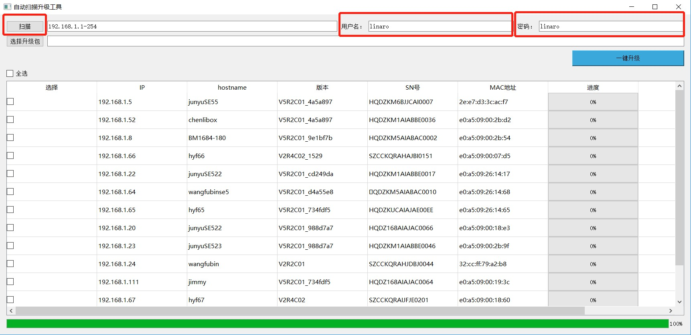
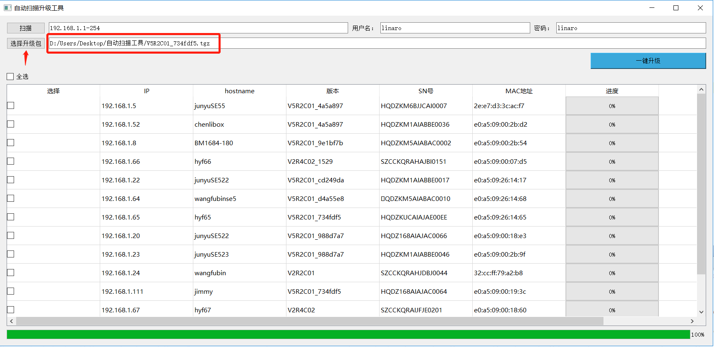
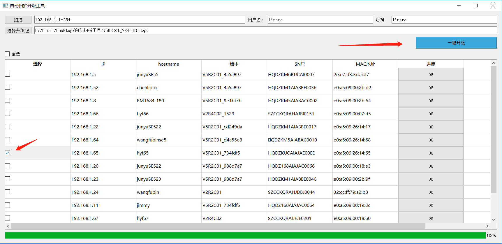
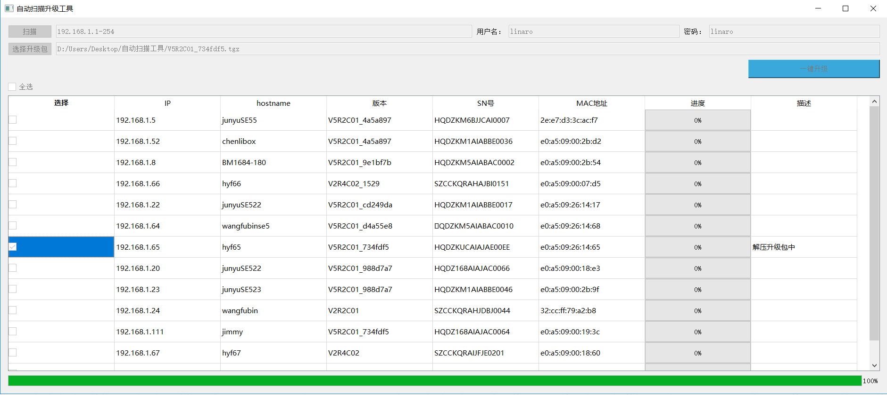

# 扫描升级工具

注：最新版本下载地址请联系支持人员

### **1）、升级前准备工作**

1、提前准备好ota升级包，升级包可联系支持人员获取

### 2）、双击扫描升级工具，开始扫描升级

1、填写扫描的网络ip范围，以及SE5 ssh登录用户名和密码，并点击扫描，默认ip范围在192.168.1.1-254，如果有多个需要扫描的局域网，则用英文半角逗号分隔，如192.168.1.1-254,192.168.2.1-254

2、点击选择升级包按钮，选择需要升级的升级包：

3、在扫描出的SE5列表中，勾选需要升级的SE5， 若需要全选，则勾选全选按钮，然后点击一键升级：

4、开始升级过程中，进度条会显示当前的进度，在描述中会有当前的进度描述：

5、升级成功后，可以再次选择需要升级的SE5，重复上述步骤。