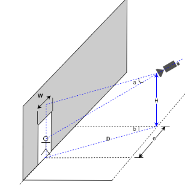

# 网络摄像机、抓拍机选型及部署指南

​	在选型网络摄像机之前，需要帮忙确定一个参数：

​	距离D：摄像机安装位置距人员入口的水平距离。

那么摄像头的选择及安装有如下几个需求：

1)  最大的检测宽度**W：2.5m**；

2)  镜头焦距选择 **f = 2.8 * D(mm)，镜头焦点定在通道出入口**；

3）摄像机俯视角度 **a  ： 10度 左右（7度 ~ 13度）**；

4)  水平偏转角：**b < 30度，即长度 e 越小越好**；

5）建议安装高度**H=0.18*D + 1.5（m），约为2.0m ~ 3.0m**。

6）抗逆光，或星光级（视需求）

具体的参数可以参考如下表格选择：

| 监控距离（m） | 镜头焦距（mm） | 相机安装高度（m） | 监控宽度（m） | 俯视角 |
| ------------- | -------------- | ----------------- | ------------- | ------ |
| 2.5           | 8              | 2                 | 2.5           | 10度   |
| 4             | 12             | 2.2               | 2.5           | 10度   |
| 6             | 16             | 2.5               | 2.5           | 10度   |
| 8             | 25             | 3                 | 2.5           | 10度   |

对于普通的网络摄像机：

1）输出的视频**分辨率<= 1080P**；

对于智能抓拍机：

1）输出的图片中**人脸大小需要大于120像素，即两眼瞳距之间需要大于60像素；**

2）支持FTP协议

