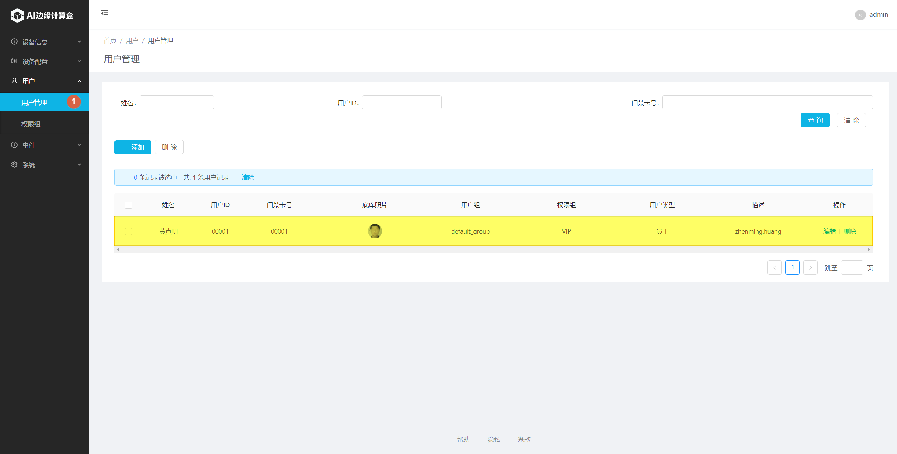

# 闸机模式

# 一、系统网络图

1. 参考下图，将各个设备加入同一局域网络内。 

    

# 二、闸机和门禁机设置

1. 查看闸机或门禁机的IP地址，后面配置中会用到。
   在阃或门禁机设备屏幕上单击，右上角会出现“设置”图标，进入到设置页面。然后在“关于”页面查看IP地址，记在本子上。 
     

   

# 三、SE5 AI计算盒设置

1. 使用Chrome浏览器，打开SE5 web界面: http://se5-ip，然后输入用户名和密码（默认均为admin）。 
    
2. 设置工作模式为“单机模式” 
    
3. 添加对应权限组 

    

   增加完成后如下图所示。可以点 “Add”继续增加其它权限组。 

    

    

4. 为权限组增加相应的用户 
    
    
   增加完毕后，用户列表显示如下： 
    

5. 添加闸机 
   

   

   
   
   2). 点击“添加”按钮弹出添加设备弹窗
   
   3). 输入“闸机名称”
   
   4). 选择"photo"类型，并输入正确的"闸机ip地址"
   
   5). 选择正确的"权限组"
   
   6). 点击“确认”按钮，添加闸机设备成功
   
   7). 点击“编辑”修改闸机设备信息
   
6. 确认闸机或门禁机接收到配置
   在阃或门禁机设备屏幕上单击，右上角会出现“设置”图标，进入到设置页面。选择“基本配置”，确认2，3，4项的内容是否正确。 

      

# 四、系统功能验证

1. 进行人脸识别验证
   请已经注册的人员站在闸机或门禁机前面适合位置上（设备正前方约1米左右），确认系统可以识别出正确的用户并且将注册照片回显在屏幕上。 
    
2. 查看识别历史记录
   正常情况下，这时可以在识别历史记录页查查看到刚才识别成功的事件。 
    