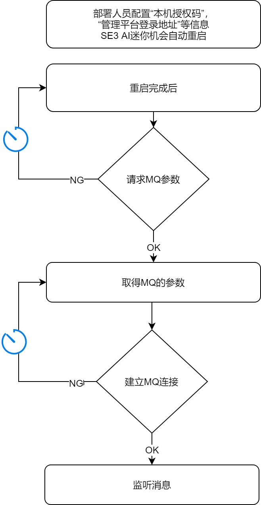
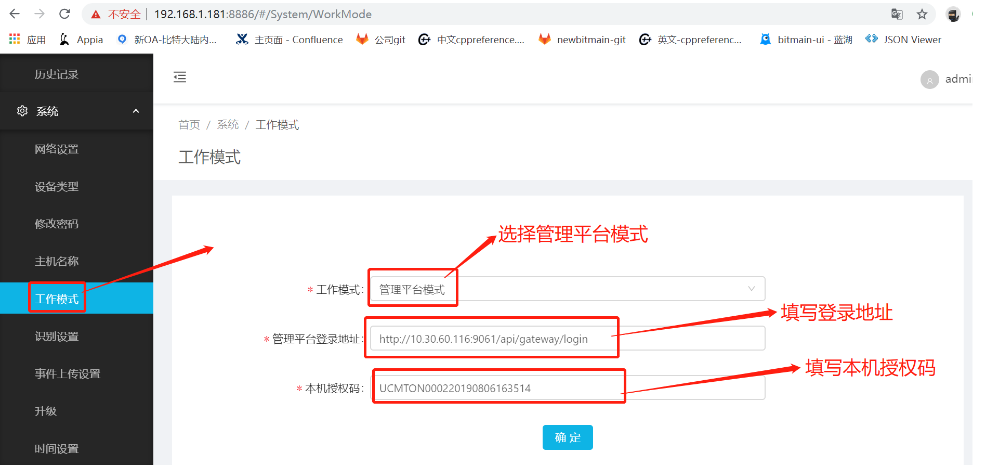

#工作模式

SE3 AI 迷你机和管理平台对接第一步需要先设置好工作模式以便和管理平台建立连接进行各种数据交互。 
##建立连接流程
部署人员在SE3 AI 迷你机提供的配置页面中，完成“本机授权码”，“管理平台登录地址”等信息的配置后，SE3 AI 迷你机就会向管理平台发出一个http请求（登录接口），获取到MQ连接需要的一些基本参数信息。  
“本机授权码”是由管理平台提供的，用于认证接入设备。如下图：

##操作流程##

