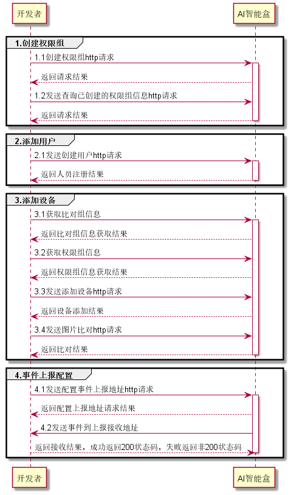

# 人脸注册比对流程示例




python3代码示例：

```
import requests
import json
import base64


box_ip = "192.168.1.22"   #AI智能盒IP
permission_name = "测试权限组"  #创建人脸比对权限组
image_file_path ="./test.jpg"  #测试注册人脸图片路径
pc_ip = "192.168.1.63"    #开发者机器ip，用于测试时，模拟设备ip
upload_event_url= "http://www.xxx.com/event_recieve"       #开发者服务器用于接收产生的比对事件的接口

#1.创建权限组
def create_permission():
    #1.1创建权限组===================================================================
    headers = {'Content-Type': 'application/json'}
    url = 'http://{}:5555/SophonFogSys/api/permissions?'.format(box_ip)     #权限组restful接口
    result = {}
    post_data = {
        "permission_name": permission_name,
        "description": "测试权限组",
    }
    json_post_data = json.dumps(post_data)
    response = requests.post(url, data=json_post_data, headers=headers, verify=False)   #调用创建人脸
    if response.status_code == 200:
        result = response.json()
    else:
        result = response.json()

    return result


def search_permission():
    #1.2查询已经创建的权限组信息，特铁是permission_id信息==================================
    permission_id = ""
    permissionfindurl = "http://{}:5555/SophonFace/api/permissions?info.name={}&exact=true".format(box_ip,permission_name)
    permissions_result = requests.get(permissionfindurl, verify=False)

    if permissions_result.status_code == requests.codes.ok:
        permissions_result_json = permissions_result.json()
        if permissions_result_json['data']:
            for per_permission_info in permissions_result_json['data']:
                if permission_name == per_permission_info['info']['name']:
                    permission_id = per_permission_info['_id']
                    info_dict = per_permission_info['info']

            # 如果没有找到对应的组返回error
            if not permission_id:
                raise RuntimeError("not found the permission")
    else:
        raise RuntimeError("get permission info error")

    return permission_id


#2.添加用户
def add_user(permission_id):
    headers = {'Content-Type': 'application/json'}
    url = 'http://{}:5555/SophonFogSys/api/users'.format(box_ip)
    result = {}

    #读取需要注册的人脸图片
    image_base64_str = ''
    with open(image_file_path, 'rb') as fp:
        image_binary = fp.read()
        image_base64_str = base64.b64encode(image_binary).decode("utf-8")

    #按照接口文档，准备好注册人员的信息
    post_data = {
        "group_name": "default_group",
        "identity_id": "666666",
        "reg_photo": image_base64_str,
        "create_no_exit_permission": False,
        "ignore_exist": False,
        "info": {
            "name": "张明",
            "type": 1,          #注册类型为1，即员工
            "permission_ids": [permission_id]     #需要注册的权限组id
        },
        "fiqa_level": "custom"
    }
    json_post_data = json.dumps(post_data)

    #2.1调用人脸注册接口进行==========================================================
    response = requests.post(url, data=json_post_data, headers=headers, verify=False)
    if response.status_code == 200:
        result = response.json()
    else:
        result = response.json()


    return result


#3.添加设备， 此处将开发者服务器ip模拟为闸机ip
def add_device(permission_id):

    #3.1  获取group_id==========================================================
    headers = {'Content-Type': 'application/json'}
    groupfindurl = "http://{}:5555/SophonFace/api/groups?info.name=default_group&exact=true".format(box_ip)
    group_id = ""
    groups_result = requests.get(groupfindurl, verify=False)
    if groups_result.status_code == requests.codes.ok:
        groups_result_json = groups_result.json()
        if groups_result_json['data']:
            # 更新分组人员
            for per_group_info in groups_result_json['data']:
                if "default_group" == per_group_info['info']['name']:
                    group_id = per_group_info['_id']

            # 如果没有找到对应的组返回error
            if not group_id:
                raise RuntimeError("not found the group")
    else:
        raise RuntimeError("get group info error")

    # 3.2获取permission_id=======================================================
    permission_id = ""
    permissionfindurl = "http://{}:5555/SophonFace/api/permissions?info.name={}&exact=true".format(box_ip,
                                                                                                   permission_name)
    permissions_result = requests.get(permissionfindurl, verify=False)

    if permissions_result.status_code == requests.codes.ok:
        permissions_result_json = permissions_result.json()
        if permissions_result_json['data']:
            for per_permission_info in permissions_result_json['data']:
                if permission_name == per_permission_info['info']['name']:
                    permission_id = per_permission_info['_id']
                    info_dict = per_permission_info['info']

            # 如果没有找到对应的组返回error
            if not permission_id:
                raise RuntimeError("not found the permission")
    else:
        raise RuntimeError("get permission info error")

    # 3.3在盒子上添加设备=========================================================
    url = 'http://{}:5555/SophonDevice/api/Devices'.format(box_ip)
    try:
        new_dict = {}
        new_dict = {
            "devices_list":[
                {
                    "device_type":"photo",
                    "netRelay":{

                    },
                    "is_start_rtmp":False,
                    "device_name":"63",
                    "device_key":pc_ip,
                    "group_id":group_id,
                    "permission_id":permission_id
                }
            ]
        }
        response = requests.post(url, json=new_dict, headers=headers, verify=False)
        if response.status_code == 200:
            result = response.json()
        else:
            result = response.json()


    except ConnectionError as e:
        raise e


    #3.4发送人脸比对图片===========================================================
    headers = {'Content-Type': 'application/json', "Connection": "close"}
    url = 'http://%s:5555/SophonMatch/api/PictureMatch' % (box_ip)

    with open(image_file_path, 'rb') as f:
        image = f.read()
        rgb_image_base64 = base64.encodebytes(image).decode('utf-8')

    data = {
        "rgb_image_base64" :rgb_image_base64,
        "device_ip": pc_ip                        #模拟的采集端设备ip，此处为开发者服务器模拟的闸机ip
    }
    json_data = json.dumps(data)
    result = requests.post(url, json_data, headers=headers, verify=False, timeout=5)
    if result.status_code == requests.codes.ok:
        print("send ok")
    else:
        print(result.json())
    return "success"

#4.事件上传地址配置
def event_upload():

    #4.1 配置设备上传地址
    headers = {'Content-Type': 'application/json', "Connection": "close"}
    url = 'http://%s:5555/SophonFogSys/api/HistoryEventUrl' % (box_ip)


    data = {
        "history_upload_event_url": [upload_event_url],
        "content-type": "json",
        "reported_peroid": 1,
        "history_need_recognize_face": False,
        "history_need_reg_pic": True,
        "history_need_spot_pic": False
    }
    json_data = json.dumps(data)
    result = requests.post(url, json_data, headers=headers, verify=False, timeout=5)
    if result.status_code == requests.codes.ok:
        print("send ok")
    else:
        print(result.json())

    return "success"

if __name__ == '__main__':
    #1.创建权限组
    create_permission()
    #2.获取权限组id
    permission_id = search_permission()
    #3.添加用户
    add_user(permission_id)
    #4.添加设备
    add_device(permission_id)
    #5.配置事件上传
    event_upload()
```

