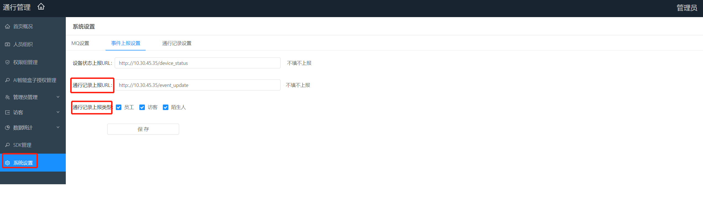

# 上报方式 #

人员通行事件发生时，sophonsight管理平台调用用户系统接口上报人员通行记录给用户系统。本章节介绍相关上报接口的约定协议，用户系统按约定协议实现接口，管理员登录sophonsight管理平台配置上对应URL。

## 1.1 相关配置 ##

在sophonsight管理平台通行管理->系统设置页面，点击事件上报设置可以进行相关的配置。包括通行记录上报URL和通行记录上报人员类型。如下图：



## 1.2 接口列表 ##

上报接口由第三方实现，在事件发生时调用第三方接口，给对方上报对应事件

### 1.2.1 人员通行记录上报 ###

AI盒子向管理系统上报通行记录时，管理平台上报通行记录给第三方系统。

**URI**

第三方给出，在管理系统配置上

**Method**

POST

**请求参数**

| **一级参数**  | **二级参数**   | **类型** | **选择** | **说明**                                                     |  举例  |
| ------------- | -------------- | -------- | -------- | ------------------------------------------------------------ | --------------------------------- |
| identity_id   |                | string   | **必选** | 用户编号                                                     | "12345565"                        |
| device_id | | string | **必选** | 产生event的设备id，uuid |  |
| identity_name |                | string   | **必选** | 用户名称                                                     | "Tom"                             |
| identity_info | | dict | **必选** | 人员底库注册时候的info字段，陌生人为空字典 |  |
| group_name    |                | string   | **必选** | 比对的group name，如果没有group_name返回group_id             | "default_group"                   |
| reg_pic       |                | base64   | 可选     | 注册的人脸底库，默认上传，可配置去除                         | "/9j/6QAEAAD/2wBD..."             |
| timestamp     |                | int32    | **必选** | 事件发生的时间戳                                             | 1565771454932                     |
| score         |                | float    | **必选** | 比对的分数                                                   | 0.78                              |
| ext_data      |                | dict     | **必选** | 拓展数据字段，可迭代添加                                     |                                   |
|               | device_ip      | sting    | **必选** | 设备ip                                                       | "192.168.1.101"                   |
|               | spot_pic       | base64   | 可选     | 现场照片，迎宾机模式下不传                                   | "/9j/6QAEAAD/2wBD..."             |
| | recognize_face | base64 | 可选 | 背景图中经过剪切后的人脸图 | "/9j/xxewAAD/wds2..." |
|               | person_type    | int      | **必选** | 1：员工（默认为员工，包括这个字段不存在的情况）<br />2：访客<br />3：黑名单<br />4：陌生人<br />5：VIP | 1                                 |
|               | device_type    | string   | **必选** | 0：闸机 <br />1：抓拍机 <br />3：IPC 动态 <br />4：门禁 | 0                                 |
|               | grab_fiqa_info | dict     | **必选** | 返回抓拍机得人脸质量检测结果，详细参考历史信息详情示例       |                                   |
|               | box_fiqa_info  | dict     | **必选** | 返回AI BOX得人脸质量检测结果，详细参考历史信息详情示例(臻识抓拍机有效) |                                   |

**请求示例**

```
{
    "reg_pic":"/9j/6QAEAAD/2wBD...",
    "ext_data":{
        "person_type":5,
        "grab_fiqa_info":{

        },
        "device_ip":"192.168.1.243",
        "box_fiqa_info":{

        },
        "device_type":"0",
        "spot_pic":"/9j/6QAEAAD/2wBD..."，
        "recognize_face":"/9j/xxewAAD/wds2..."
    },
    "identity_id":"666666",
    "device_id":"23c7232b-0b35-4813-be6b-6ec4ee21ac4f",
    "identity_info":{
            "image_id" : "7bab3d75-ae0b-44db-bbbd-8d5eb788385a",
        "permission_ids" : [ 
            "9ded10eff6804f3da4d99c25fcaf7383"
        ],
        "type" : 1,
        "user_id" : "01220615",
        "face_ids" : [ 
            "53be77f3-91a7-4835-bbb8-1cced2354785"
        ],
        "name" : "ran93717829",
        "ext_info" : {
            "building_no" : "1",
            "room" : "101",
            "address" : "address",
            "floor" : "1"
        }
    }
    "score":0.6231614351272583,
    "timestamp":1566016554020,
    "group_name":"default_group",
    "identity_name":"小明"
}
```

**返回示例**

    {     
    	"message": "SUCCESS",
    	"status": 0
	}
