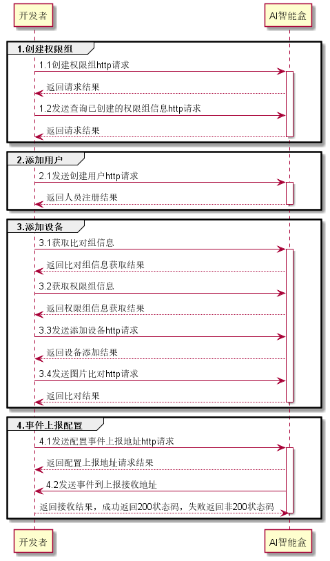

# 人脸注册比对流程示例




python3代码示例：

```
import requests
import json
import base64


box_ip = "192.168.1.22"   #AI智能盒IP
permission_name = "测试权限组"  #创建人脸比对权限组
image_file_path ="./test.jpg"  #测试注册人脸图片路径
pc_ip = "192.168.1.63"    #开发者机器ip，用于测试时，模拟设备ip
upload_event_url= "http://www.xxx.com/event_recieve"       #开发者服务器用于接收产生的比对事件的接口

#1.创建权限组
def create_permission():
    #1.1创建权限组===================================================================
    permission_id = ""
    headers = {'Content-Type': 'application/json'}
    url = 'http://{}:5555/sophon/v2/face/createpermission'.format(box_ip)     #权限组restful接口
    result = {}
    post_data = {
        "permission_name": permission_name,
        "description": "测试权限组",
    }
    json_post_data = json.dumps(post_data)
    response = requests.post(url, data=json_post_data, headers=headers, verify=False)   #调用创建人脸
    if response.status_code == 200:
        result = response.json()
        permission_id = result.get('permission_id', '')
    else:
        result = response.json()

    return permission_id


#2.添加用户
def add_user(permission_id):
    headers = {'Content-Type': 'application/json'}
    url = 'http://{}:5555/sophon/v2/face/createidentity'.format(box_ip)
    result = {}

    #读取需要注册的人脸图片
    image_base64_str = ''
    with open(image_file_path, 'rb') as fp:
        image_binary = fp.read()
        image_base64_str = base64.b64encode(image_binary).decode("utf-8")

    #按照接口文档，准备好注册人员的信息
    post_data = {
        "identity_name": "张明",
        "identity_id": "666666",
        "register_image": image_base64_str,
        "user_type":"vip",
        "permission_ids": [permission_id],
        "fiqa_level": "high"
    }
    json_post_data = json.dumps(post_data)

    #2.1调用人脸注册接口进行==========================================================
    response = requests.post(url, data=json_post_data, headers=headers, verify=False)
    if response.status_code == 200:
        result = response.json()
    else:
        result = response.json()
    return result


#3.添加设备， 此处将开发者服务器ip模拟为闸机ip
def add_device(permission_id):
    # 3.1在盒子上添加设备=========================================================
    url = 'http://{}:5555/sophon/v2/face/addmediadevice'.format(box_ip)
    try:
        new_dict = {
        	"media_device_type":"photo",
        	"media_device_name":"63",
        	"media_device_url":pc_ip,
        	"permission_id":permission_id
        }
        response = requests.post(url, json=new_dict, headers=headers, verify=False)
        if response.status_code == 200:
            result = response.json()
        else:
            result = response.json()
    except ConnectionError as e:
        raise e

    #3.2发送人脸比对图片===========================================================
    headers = {'Content-Type': 'application/json', "Connection": "close"}
    url = 'http://%s:5555/sophon/v2/face/search' % (box_ip)
    with open(image_file_path, 'rb') as f:
        image = f.read()
        rgb_image_base64 = base64.encodebytes(image).decode('utf-8')

    data = {
        "rgb_image_base64" :rgb_image_base64,
        "media_device_ip": pc_ip                        #模拟的采集端设备ip，此处为开发者服务器模拟的闸机ip
    }
    json_data = json.dumps(data)
    result = requests.post(url, json_data, headers=headers, verify=False, timeout=5)
    if result.status_code == requests.codes.ok:
        print("send ok")
    else:
        print(result.json())
    return "success"

#4.事件上传地址配置
def event_upload():

    #4.1 配置设备上传地址
    headers = {'Content-Type': 'application/json', "Connection": "close"}
    url = 'http://%s:5555/sophon/v2/face/setconfigs' % (box_ip)
    data = {
    		"config_dict":{
    			"HISTORY_EVENT_UPLOAD_URL": upload_event_url
    		}
    }
    headers = {'Content-Type': 'application/json'}
    json_data = json.dumps(data)
    result = requests.post(url, json_data, headers=headers, verify=False, timeout=5)
    if result.status_code == requests.codes.ok:
        print("send ok")
    else:
        print(result.json())
    return "success"

if __name__ == '__main__':
    #1.创建权限组
    permission_id = create_permission()
    #2.添加用户
    add_user(permission_id)
    #3.添加设备
    add_device(permission_id)
    #4.配置事件上传
    event_upload()
```

