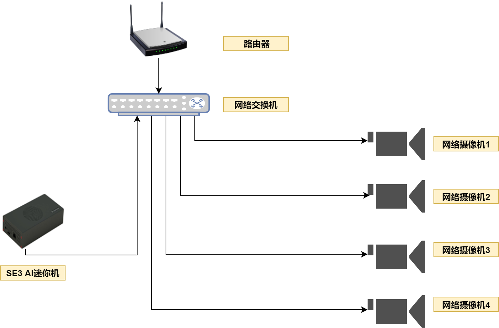
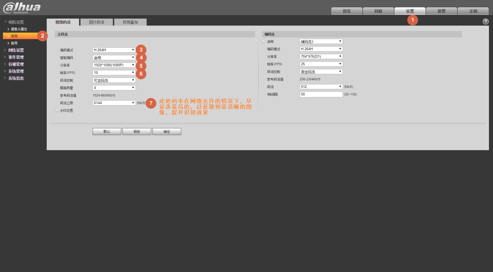
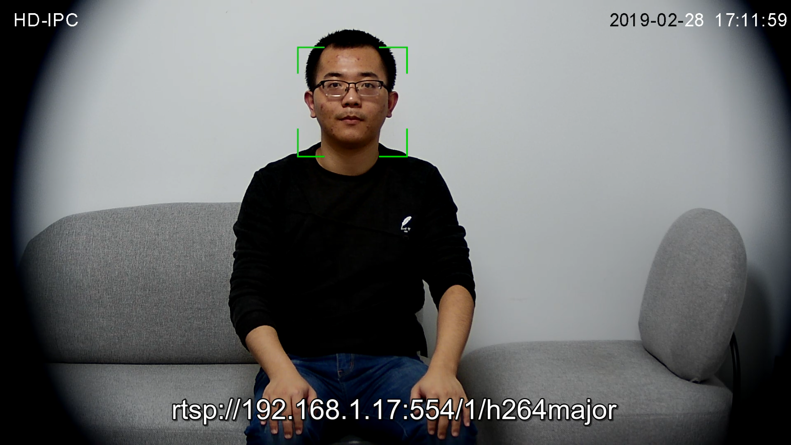
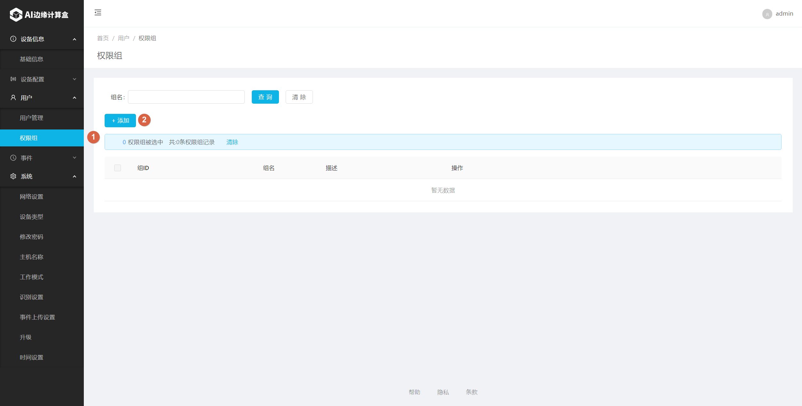
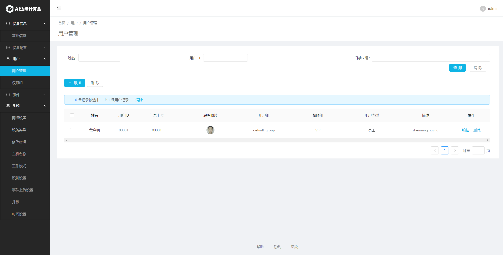
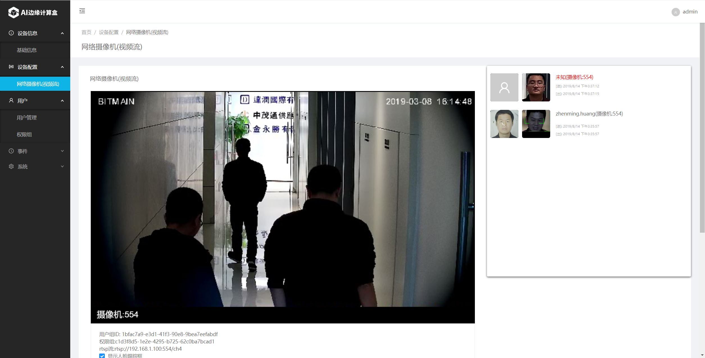
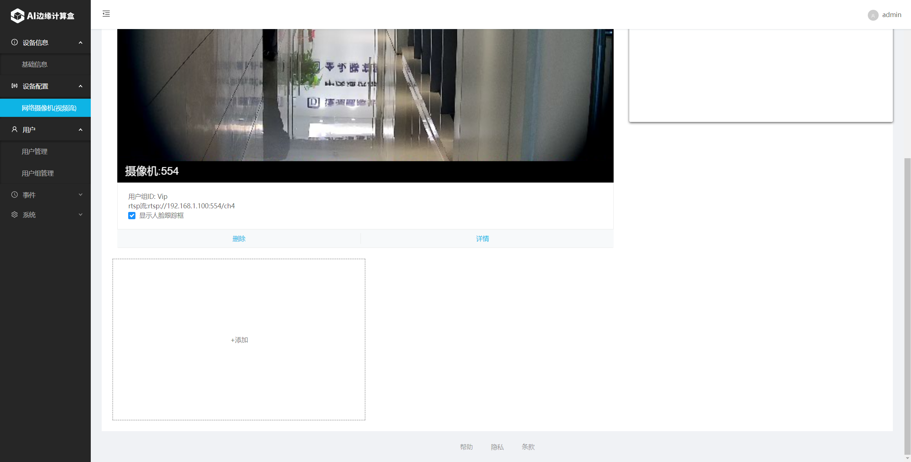
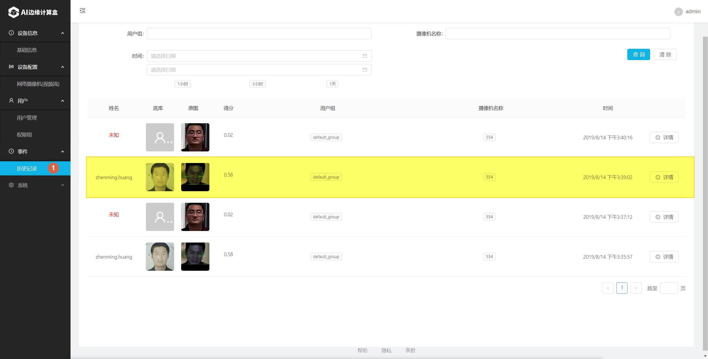

# 网络摄像机模式

[网络摄像机选型及部署指南](../IPCandSetup.md)

## 一、系统网络图

1. 参考下图，将各个设备加入同一局域网络内。  

## 二、设置网络摄像机

1. 首先设置网络摄像机，确保摄像机可以输出正确的网络视频流。
   不同的网络摄像机配置界面各不相同，请查看对应的产品说明书进行配置。以下以大华网络摄像机(IPC-HFW4243K-ZFD-LED)举例说明。 
    
2. 使用Chrome浏览器，输入网络摄像机的IP地址进入IPC设置视频界面。帧率和分辨率推荐使用1080P/15fps（此为SE3支持的最高视频格式，超出这个设置会导致系统无法接收网络摄像机视频输入），在网络带宽允许的情况下，码率尽可能设置为最大值，以增加图像的清晰度，获得最佳识别效果。 
    
3. 验证网络摄像机的视频流输出
   市面上网络摄像机的RTSP视频流输出地址不尽相同，请以官方网站说明或产品说明书为主。但通常来讲，一般格式如下： rtsp://用户名:密码@ip。为了确保我们设置到SE3 AI迷你机的地址是正确的，可以在电脑上安装 VLC播放器，用它来打开对应的网络视频流地址，如果VLC能正常播放并看到现场图像，则说明我们设置的地址是正确的。
   VLC正确的播放画面参考如下： 
    

# 三、设置SE3 AI迷你机

1. 使用Chrome浏览器，打开SE3 web界面: https://se3-ip:8886/，然后输入用户名和密码（默认均为admin） 
    

2. 选择 采集端类型为 "网络摄像机(视频流)" 
    

3. 增加相应的权限组 
    

   增加完成后如下图所示。可以点 “Add”继续增加其它用户组。 

    

    

4. 为用户组增加相应的用户 
    
    
   增加完毕后，用户列表显示如下： 
    

5. 增加网络摄像机
   在设备配置→网络摄像机(视频流)下面，点击添加，增加设备。 

    

   参照下图填写好对应的网络摄像机配置信息，填入RTSP码流地址，选择需要绑定的用户组，并命名。 

    

    

   可以按照上述步骤，依次添加其余的网络摄像机。每台 SE3 AI迷你机最多同时添加4台网络摄像机。 

    

# 四、查看人脸识别结果

1. 在完成上述配置后，接下来可以开始人脸识别。

   请已经添加用户的人员站在网络摄像机的前方合适位置，查看是否能正常识别。 
    

2. 去历史事件记录页面查看识别记录，可以看到已经可以正常识别出注册用户，说明人脸识别系统设置成功。 
    