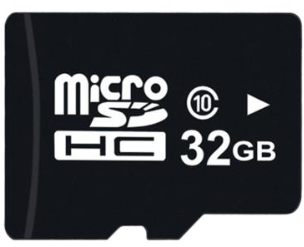
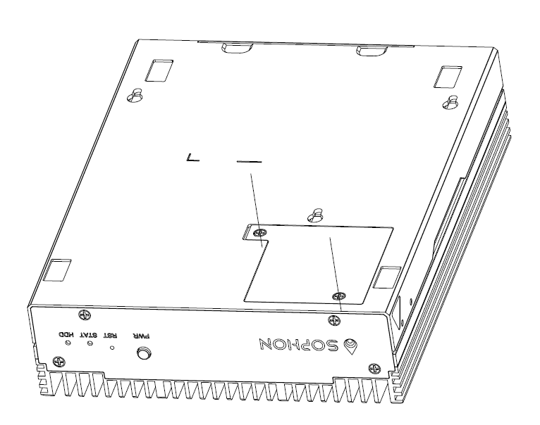
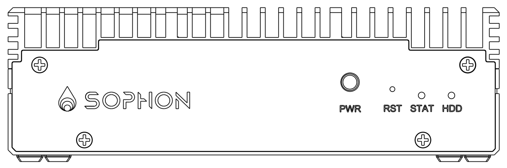
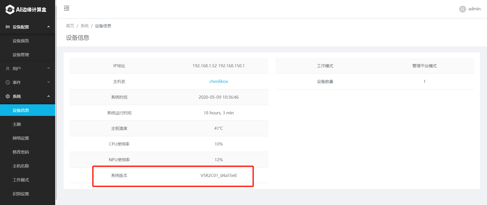

# SE5 边缘计算盒系统升级指南

本文介绍版本升级是通过SD卡烧录方式进行。

请提前准备：

​	1）至少16G 存储的Micro SD。

​	2）一个配套的读卡器

## 获取最新版本

注：最新版本下载地址请联系支持人员。

### 1）下载版本：

### 2）校验压缩文件

所有的文件都下载完成后，请查看md5值是否与同服务器端的md5值保持一致。

## 制作SD卡

准备一张sd卡32G/8G/16G的就可以。格式化成fat32.保证必须要一个分区例如：/dev/sda1，而非/dev/sda。

1）解压文件

2）拷贝所有文件到sd卡根目录（不要放在额外文件夹下面）

## 升级SE5 AI迷你机版本

整个升级过程持续15~20分钟，期间需要手动**重启一次**。

1）插入sd卡到se5，上电。

sd卡卡槽位于维护窗中，需要拆开维护窗。

2）可以观察电源旁边的STAT led 灯，当灯为红色时，表示在升级过程中，当灯为绿色时，代表升级结束并成功，当灯熄灭了，代表升级失败。

3）断电，拔掉sd卡，升级完成。

## 确认系统版本

升级完成后，SE5 边缘计算盒默认IP地址为：**192.168.150.1** （网络通过LAN连接）

WebUI访问地址为：http://192.168.150.1

用户名：admin

密码：admin

登录成功后，请及时修改密码。

​	注意：暂时只支持Chrome  76.0.3809.132（其他版本兼容性未确认）

