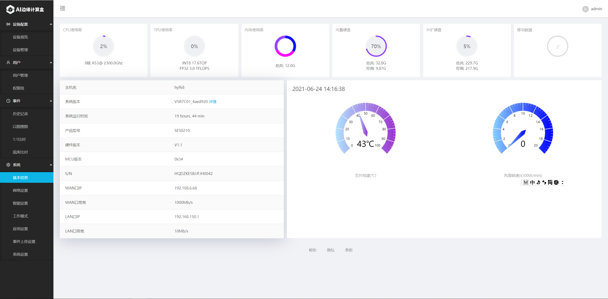
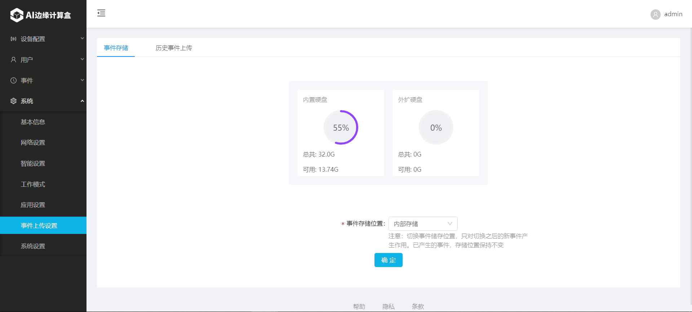

# AI计算盒SE5

## 1.2 LiteOS后台管理系统

注意: 随着软件版本的迭代，在某些界面上可能存在差异。

### 1.2.1 软件功能特性

- 深度定制人脸检测，跟踪，识别，属性检测等算法
- 支持16路动态视频流或32路图片流输入，完成人脸检测、识别、预览、事件存储全过程
- 支持IPC相机、人脸抓拍机、人脸闸机、门禁机等多种类型采集设备混合添加使用
- 支持底库规模大，10万大底库下，毫秒级反应速度，识别时间<0.5s，通行更顺畅
- 支持单机和联网模式，拥有独立完善的平台管理功能
- 支持陌生人自动建库，陌生人底库自优化更新，并可在指定联网计算盒之间完成同步
- 支持数据库访问控制，确保数据安全
- 支持批量导入底库，系统版本批量升级等功能，使用更方便
- 接口丰富，对接灵活，方便第三方系统集成

### 1.2.2 设备配置

#### **1.2.2.1** **设备预览**

**1.2.2.2** **设备预览**

### 1.2.3 用户

#### **1.2.3.1** **用户管理**

#### **1.2.3.2** **权限组管理**

### 1.2.4 历史记录

(1) 历史记录

 （2）以图搜图

 （3）1:1比对

（4） 底库比对

### 1.2.5 系统

#### 1.2.5.1 基本信息

#### 1.2.5. 2 网络配置

#### 1.2.5.3 智能设置

配置人脸识别算法相关智能参数，包括人员底库容量、开启陌生人入库、最小人脸像素调整、匹配阈值及识别记录去重间隔等。

#### 1.2.5.4 工作模式

目前支持两种工作模式。

•             单机模式。

•             管理平台模式。管理平台模式需要配合[管理平台](../../api-lie-biao/xi-tong-dui-jie-shuo-ming-shu/dui-jie-guan-li-ping-tai/README.md)使用。

#### **1.2.5.5 应用设置**

（1）主题配置

（2）用途设置

#### 1.2.5.6 事件上传设置

（1）事件存储，可以配置事件存储位置为内部存储或外接硬盘存储等，同时展示存储信息。

（2）配置事件上传的地址

#### 1.2.5.7 系统设置

（1） 时间设置

（2）密码更改

（3）主机名更改

（4）重启设置

（5）系统调试

（6）数据还原

