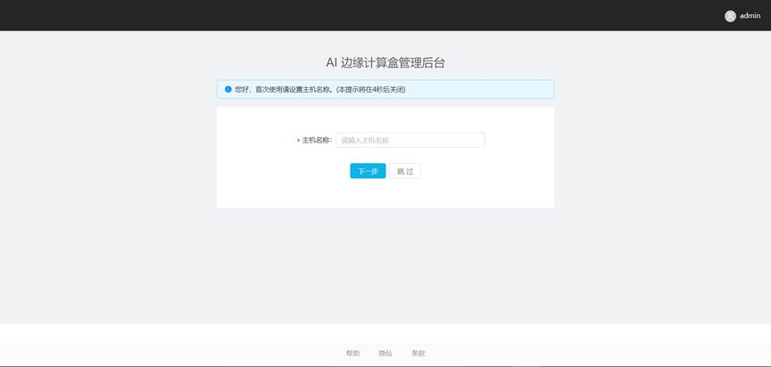
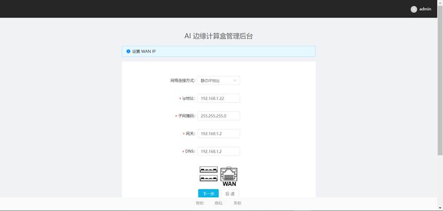
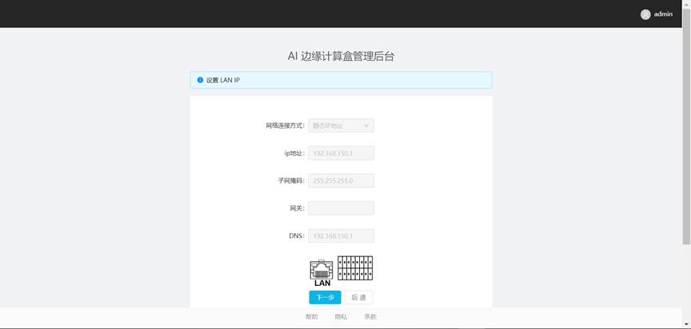
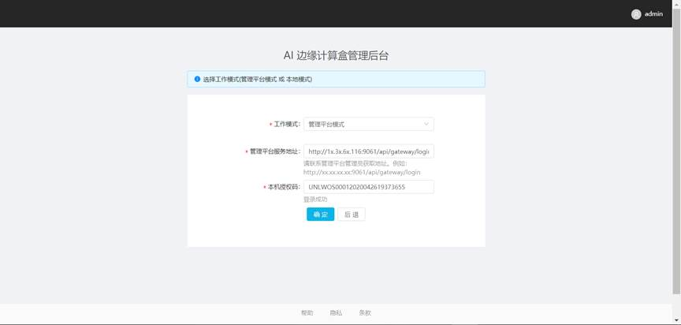

# AI计算盒SE5

## 5.1 开机向导

注意: 随着软件版本的迭代，在某些界面上可能存在差异。

假设小盒子IP地址为：192.168.1.112。

### 5.1.1 输入网址进入登录页

通过IP地址http://192.168.1.112登入管理系统界面。输入管理员账号和密码，点击登录，登入系统。

### 5.1.2 初始化设置

1）配置主机名称

根据初始化提示设置AI计算盒SE5主机名称，输入名称，点击“下一步”。

2）配置WAN口IP地址

3）配置LAN IP地址

默认LAN口的IP地址不允许更改。

4）配置工作模式。

目前支持两种工作模式。

•             单机模式。

•             管理平台模式。管理平台模式需要配合[管理平台](../../api-lie-biao/xi-tong-dui-jie-shuo-ming-shu/dui-jie-guan-li-ping-tai/README.md)使用。

 

 5）配置完成之后，请依照提示，重启小盒子。